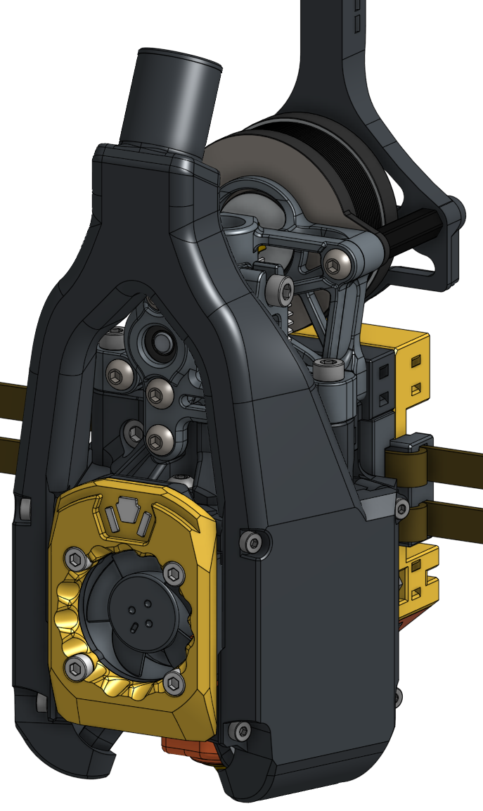
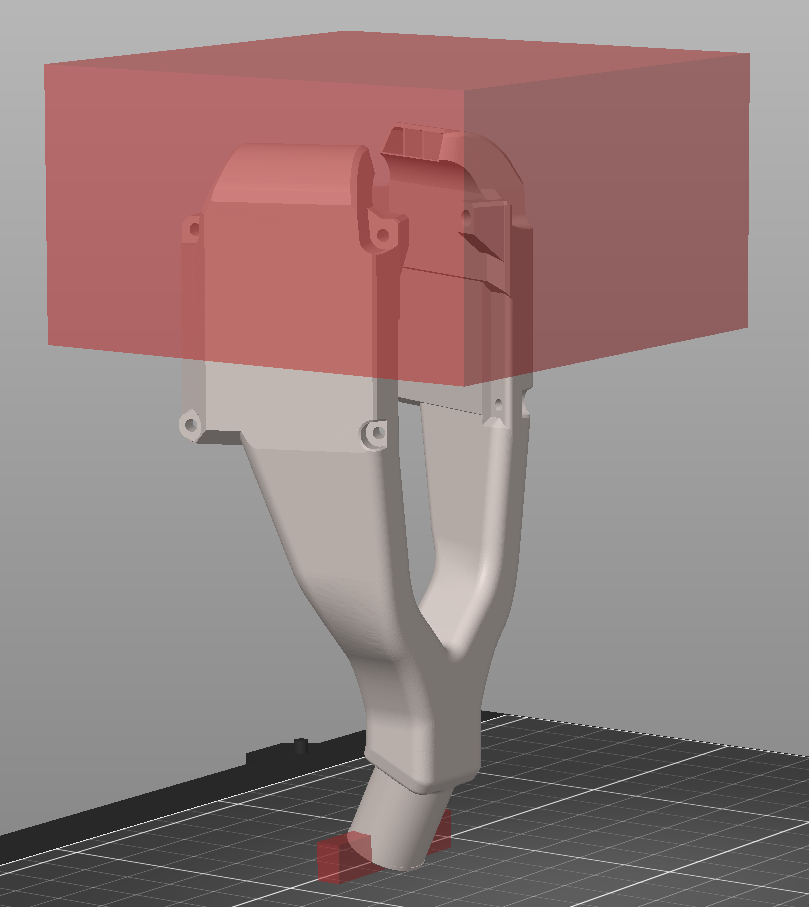

# Completely experimental CPAP drop-in for Xol-Toolhead

* Fits over existing toolhead and screws into same heatsets as the 4010 fans would
* 15mm ID CPAP hose (same as Mellow CPAP for VZ-Bot)
* Changed to a single piece that needs to be printed inverted with supports and support blockers (see images below)
* Standard shaped Xol ducts just powered by a CPAP instead of 4010

If you use this please report your findings to the Xol-Toolhead discord channel.

> [!WARNING]  
> Does not fit with Galileo 2 extruder

### Use support blockers like this

### Sliced preview
