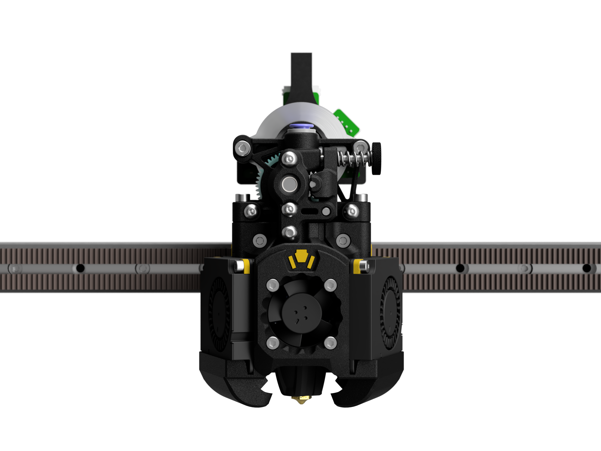

[![CC BY-NC-SA 4.0][cc-by-nc-sa-shield]][cc-by-nc-sa]

# Xol Toolhead
Xol Toolhead is the evolution of 'Mantis Xol 2' (<https://github.com/Armchair-Engineering/Mantis-Xol>). 
Aimed at modularity and quality of life improvements for installation and serviceability. 
We have left the mantis carriage behind, and thus are now just Xol sans Mantis. Don't worry, it's still ugly. We wouldn't fix that.

Project lead: [DW-Tas](https://github.com/DW-Tas)

## What's new
`Xol-Toolhead Release 2024-03-10`
### Major upate
* Quality of life improvements
  * Toolhead
    * Combined multiple printed parts to simplify assembly
    * No more M2 or M2.5 heatset inserts
    * Part cooling fans slide into the top of the ducts are are secured with 2x M2.5x8 SHCS per fan
      * Hardware reduced from 8x M2 heatsets + 8 M2 screws to just 4 M2.5 screws
    * HE Fan now uses 4x M2.5x16 SHCS (previous M2.5x20 should still work)
  * Carriage
    * Xol Carriage is now a single piece print
    * Belt clips are now the Archetype belt clip system
    * Internal path added for probe wires (sorry, won't fit the fat Beacon USB cable)
* BOM changes
  * Toolhead
    * Removed:
      * M2 and M2.5 heatsets (except for X endstop)
      * M2 Screws (except for X endstop)
    * Extruder mount front 2 SHCS now 16mm (previously 20mm)
  * Carriage
    * All versions now attache to MGN rail with M3x8 SHCS (MGN12 previously required M3x6 BHCS)
    * Archetype belt clips require 4mm OD, 0.45mm wall width tube
      * 2x 22.5mm lenghts
      * 'Has been tested with 4/3mm PTFE tube and seems OK but harder to install'
    * Belt pins are now all M3x30 for all carriage/belt combinations
      * Cut down screws now OK due to the metal tube protecting the belts
    * Added:
      * Large M3 washers and 2x M3x8 SHCS for MGN Carriage clamps (not optional, required for carriage strenght)
* Tool Requirement
  * Tightening the M3 SHCS of the toolhead "feet" to the carriage requires a M2.5 ball head hex driver. `This is due to the requirement to tighten these screws from a slight angle.`

### previous updates
`Xol-Toolhead Release 2023-12-21`
* Quality of life improvements
  * Cable routing holes are now on both sides of the toolhead
  * Cable routing holes can now fit MF3.0 commonly used on hotends
  * Awkward M3 Heatset insert replaced with easier to install M3 hex nut for front extruder mount connection
  * Rapido hotend mounting points rotated to improve wire routing
* Minimal BOM change
  * 1x M3 Hex Nut replaces 1x M3 Heatset Insert
  * 1x M3x6 BHCS replaces 1x M3x8 BHCS
* Reworked Extruder mount to Hotend mount interface
  * Old Hotend mounts will not work with new Extruder mounts and vice-versa

`Xol-Toolhead Release 2023-09-15`
* Modular approach to hotend mounts and extruders
  * Hotend mounts and extruder mounts are now separate parts
  * Extruder mounts incorporate the old Xol-Carriage or TAP adapter plates (same number of printed parts overall)
  * "Xol with bones" option: Add some screws for extra rigidity in the hotend mount
* Minimal BOM change
  * 1x M3x8 BHCS
  * 1x M3 Heatset
  * Optional "bones"
    * 2x M2x30 SHCS
    * 2x M2 Heatset
* Xol-Carriage update
  * Stronger belt clips
  * bigger probe cable channel with cable tie slot

`Xol-Toolhead Release 2023-07-14`
* Standardised hotend mounts around the Voron Design CW2/TAP carriage bolt hole pattern.
  * This approach reduces the number of hotend mounts and ducts by half - You don't have to search for TAP or non-TAP and we don't have to maintain twice as many parts
* Xol-Carriage
  * A new carriage built for Xol-Toolhead
  * Uses metal pins and a belt clip to secure the belts instead of having them squashed between mgn9/12 carriage and toolhead carriage
  * Improved serviceability - remove the toolhead from the carriage without disassembly in the printer. Unless you use Voron TAP or refuse to buy M2.5 hardware for Xol Carriage. Buy the m2.5 hardware, it's worth it trust us.
  * Modular probe mounting system - change probes without changing the whole carriage _`*Except for KlickyNG`_
* These carriage changes mean you can use any carriage that a Stealthburner bolts onto. (Our Xol-Carriage, or the stock voron carriage even.)

## Supported hardware
### Hotends
* Rapido HF
* Rapido UHF
* DropEffect XG
* DropEffect NeXtG
* Red Lizard K1-UHF
* Dragon UHF / UHF-Mini
* Dragon Standard / High Flow
* Dragon Ace
* Revo Voron
* NF-Crazy Volcano (or standard with v6 melt zone extender) 'NF-Crazy with standard wide block no longer supported without extender'

### Extruders
* Sherpa-Mini
* Annex Double Folded Ascender
* Galileo G2SA
* WristWatch G2
* WristWatch BMG
* Escapement (experimental)
* Vz-Hextrudort-Low
* LGX-Lite
* Orbiter v2.0

### Probes
* PCB Klicky
* Klicky
* Beacon
* Euclid
* Voron Design TAP `For RC8+ we suggest to use m3x50 BHCS instead of SHCS`
'KlickyNG support has been removed'

### X-Rail/Belts
* MGN12H - 6mm Belts
* MGN12H - 9mm Belts
* MGN9H - 6mm Belts
* MGN9H - 9mm Belts

### Front Idlers
Xol-Toolhead can colide with the stock voron front idlers for Trident and 2.4 when the toolhead is in the front corners of the build area. This can cause also issues with the homing sequence when homing X if the toolhead is at the front of the gantry on Y.  
Fully compatible idlers:
* clee's [BFI (Beefy Front Idlers)](https://github.com/clee/VoronBFI)
* Ramalama2's [Front Idlers](https://github.com/Ramalama2/Voron-2-Mods/tree/main/Front_Idlers)

## We've made some instructions for printing and assembly.
They took ages to make, please read them.
* [Bill of Materials (BOM)](BOM.md)
* [Printing parts](printing.md)
* [Carriage assembly](xol_carriage_assembly.md)
* [Toolhead assembly](toolhead_assembly.md)

## Acknowledgements
* [DW-Tas](https://github.com/DW-Tas) for giving Xol the giant refresh it needed.
* [CorvidBuilds](https://github.com/CorvidBuilds) for Xol1 and Xol2, the predecessors to this project.
* [Long/Mandryd](https://github.com/mandryd/VoronUsers/tree/master/printer_mods/Long/Mantis_Dual_5015) for the Mantis toolhead.
* [Derpimus](https://github.com/lraithel15133) for the exegesis, some CAD work, feedback, and just being a rad dude.
* [KayosMaker](https://github.com/KayosMaker) for the CAN board mounts and spacers.
* [JosAr](https://github.com/jlas1/Klicky-Probe) for Klicky.
* [WhoppingPochard](https://github.com/tanaes) and [VinnyCordeiro](https://github.com/VinnyCordeiro/) for PCB Klicky.
* [Nionio6915](https://github.com/nionio6915/Euclid_Probe) for Euclid.
* [VoronDesign](https://github.com/VoronDesign) for this particular CoreXY flavor.
* [AnnexEngineering](https://github.com/Annex-Engineering) for the Sherpa Mini and Double Folded Ascender extruders, and the K3 that influenced the air management of the ducts. And also for giving access to an early revision of the DFA so it could be adapted for this toolhead.
* [clee](https://github.com/clee), you know what you did.

    

This work is licensed under a
[Creative Commons Attribution-NonCommercial-ShareAlike 4.0 International License][cc-by-nc-sa].

[![CC BY-NC-SA 4.0][cc-by-nc-sa-image]][cc-by-nc-sa]

[cc-by-nc-sa]: http://creativecommons.org/licenses/by-nc-sa/4.0/
[cc-by-nc-sa-image]: https://licensebuttons.net/l/by-nc-sa/4.0/88x31.png
[cc-by-nc-sa-shield]: https://img.shields.io/badge/License-CC%20BY--NC--SA%204.0-lightgrey.svg