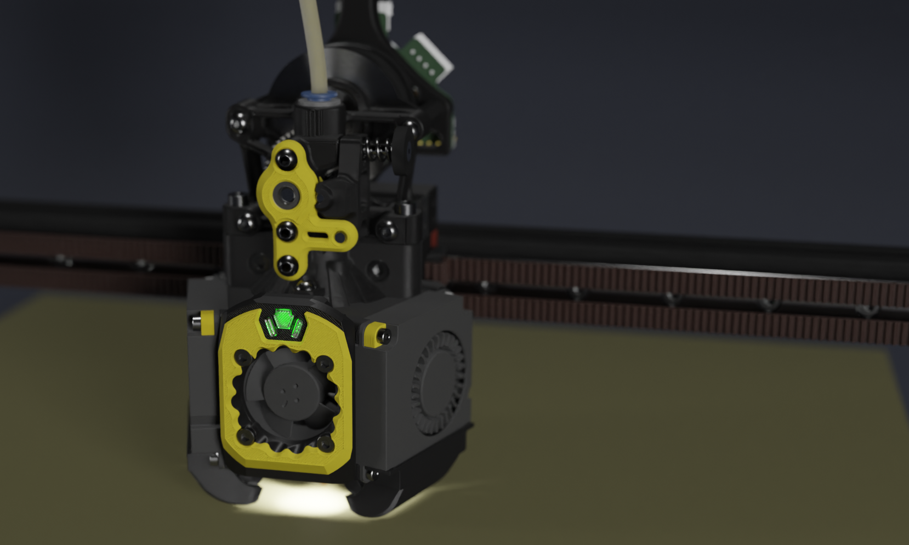

[![CC BY-NC-SA 4.0][cc-by-nc-sa-shield]][cc-by-nc-sa]

# Xol Toolhead
A soft reboot of Xol 2 (<https://github.com/Armchair-Engineering/Mantis-Xol>) aimed at modularity and quality of life improvements for installation and serviceability. We have left the mantis carriage behind, and thus are now just Xol sans Mantis. Don't worry, it's still ugly, we couldn't fix that.

Project lead: [DW-Tas](https://github.com/DW-Tas)

