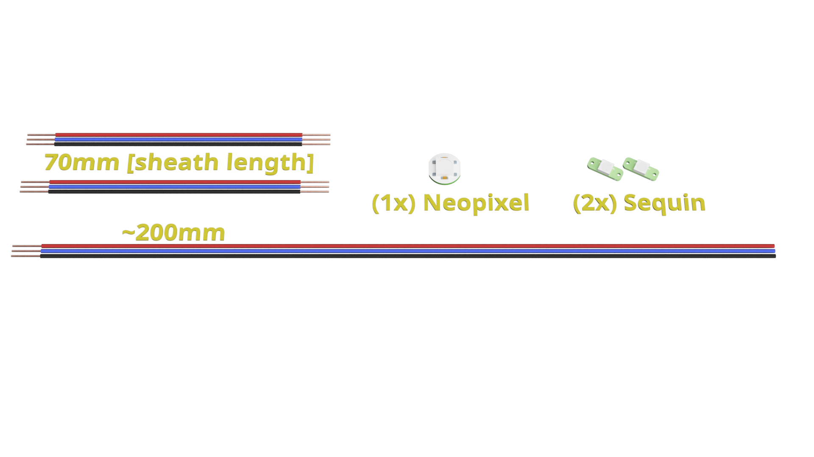
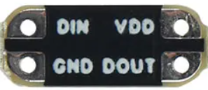
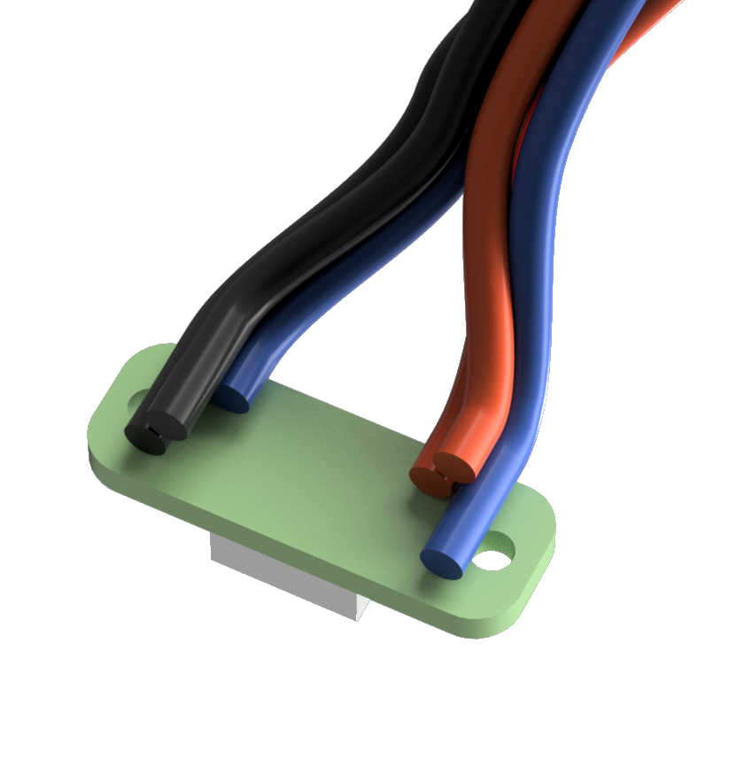
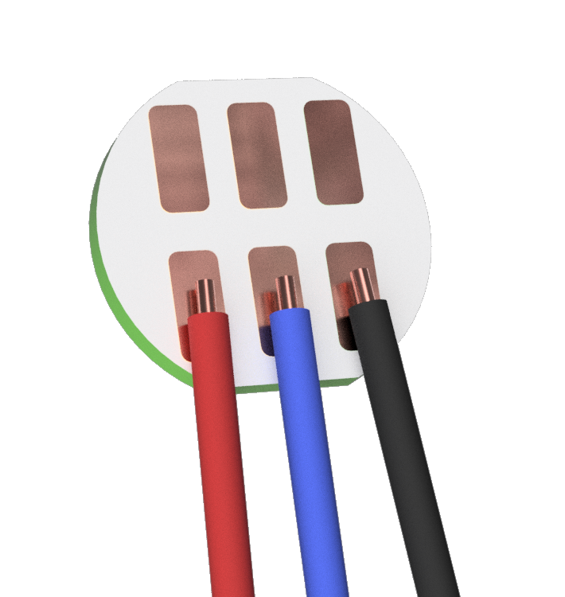
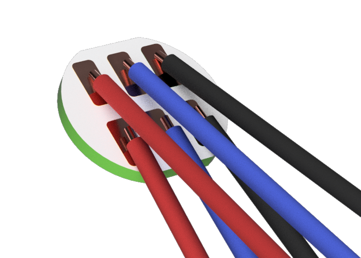
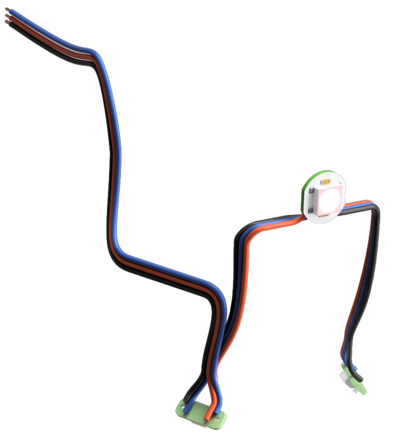

# Build instructions for Xol Toolhead LED harness
> [!WARNING]
> ## Sequin PCB thickness   
> The hotend mounts are only compatible with thin PCB board sequins.  
> Known compatible source: [FYSETC (Ali Express)](https://www.aliexpress.com/item/1005006023213341.html)

| Notes                                                                                                                                                                                                                                                                               | Image                                                                   |
| ----------------------------------------------------------------------------------------------------------------------------------------------------------------------------------------------------------------------------------------------------------------------------------- | ----------------------------------------------------------------------- |
| Required Tools                                                                                                                                                                                                                                                                      | Wire cutters Wire strippers Soldering equipment Helping hands Crimping tools to suit your connection type                                                                        |
| Get all the bits together (BoM)   (9x) Length of 26 or 28AWG electrical wire: - (3x) ~200mm with one end stripped and tinned - (6x) 70mm (sheath length) stripped and tinned at both ends (1x) Neopixel LED PCB (2x) Sequin LED PCB (0.8mm thick PCB board) JST XH (or similar) connector and pins to suit your printer |  |
|	The first sequin LED in the chain is the most difficult as there are pairs of wires (5v+ and Gnd) that need to be connected to small solder pads.  - Solder 70mm and 200mm wires together to V+ - Solder 70mm and 200mm wires together to Gnd - Solder a 200mm wire to DIN, and - Solder a 70mm wire to DOUT	|	 |
| The three 70mm wires coming out of the 1st sequin are now soldered to the V+, DIN, and Gnd pads on one side of the neopixel PCB  - All three wires should come into the PCB from the closest side to the pads, and in line with the pads.	|	|
| Now solder the remaining three 70mm wires to the correct pads.  ⚠️ **Ensure that these wires are positioned over the top of the other three and come over the PCB from the same side.** If they're not soldered like this, they won't go into the slot.	|	|
| Last bit of soldering. Take the remaining end of the 2nd 70mm wires to the corresponding V+, DIN and GND on the last sequin LED PCB.   It should now look something like this. Cut the excess of the 200mm wires to length and crimp on your connector.  Jobs done.	|	|

⬅  [Toolhead assembly](toolhead_assembly.md)