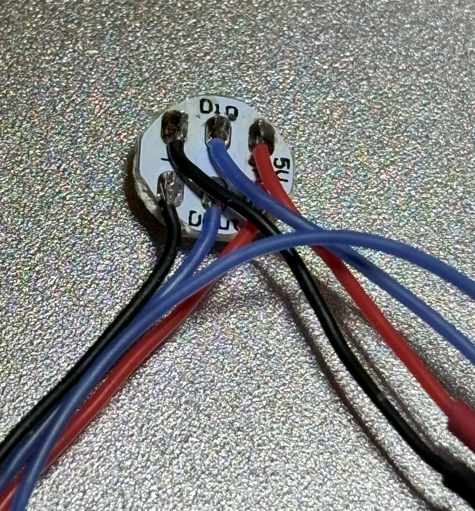

# Build instructions for Xol Toolhead LED harness
> [!WARNING]
> ## Sequin PCB thickness   
> The hotend mounts are only compatible with thin PCB board sequins.  
> Known compatible sources: 
> RGBW: [LAB4450 (EU)](https://lab4450.com/product/rgbw-sequins/) 
> RGBW: [Replimat[labs] (EU)](https://www.replimat.eu/4x-rgbw-sequins-for-xol-minisb/rt10179) 
> RGB:  [FYSETC (Ali Express)](https://www.aliexpress.com/item/1005006023213341.html)

> [!IMPORTANT]
> ## LED Order
> Wiring as shown will result in the LED order being the same as for the popular StealthBurner LED harness. 
> This should enable the use of popular LED control macros without complex modifications.

| Notes           | Image               |
|---------------- | ------------------- |
| Required Tools  | Wire cutters Wire strippers Soldering equipment Helping hands Crimping tools to suit your connection type |
| Get all the bits together (BoM)   (11x) Lengths of 26 or 28AWG electrical wire: - (3x) ~200mm `+/-/D` with one end stripped and tinned  - (4x) ~35mm `+/-`with one end stripped and tinned (+/-) - (3x) 70mm `+/-/D` stripped and tinned at both ends - (1x) ~135mm `D` stripped and tinned at both ends (1x) Neopixel LED PCB (2x) Sequin LED PCB (0.8mm thick PCB board) JST XH (or similar) connector and pins to suit your printer  `+` = 5V+ wire  `-` = Ground wire `D` = Data/Signal wire   Lengths given are for a harness that works with either UHF or standard length toolheads |                                                          |
| Follow the wiring diagram above.   The completed harness should look similar to the photos shown.     Completed Harness  |  |
| Neopixel `Status LED`     |        |
| Sequin #1 `Part Lighting` |        |
| Sequin #2 `Part Ligting`  |        |
| Powered up!               |   |

⬅  [Toolhead assembly](toolhead_assembly.md)