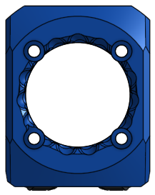
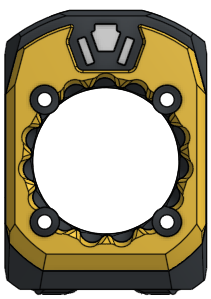
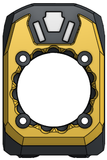

# Printing Xol Parts

### Xol parts are not scaled to suit any particular filament. You will need to calibrate your printer/filament appropriately before printing Xol Parts

It is recommended to print a calibration part of a known size and adjust slicer shrinkage compensation.
There are two test STLs below that include one belt clip and a portion of the rear carriage where the belt clip should attach. It is recommended to use this part to ensure your printer/filament is calibrated. These parts and the M3 pin should snap together with a satisfying "click" but not be too tight to take apart.
* [Xol_Carriage_test_piece_6mm belts](<../STL/Test Prints/Xol_Carriage_test_piece_6mm.stl>)
* [Xol_Carriage_test_piece_9mm belts](<../STL/Test Prints/Xol_Carriage_test_piece_9mm.stl>)

## What to print
There are many combinations of carriages/hotends/extruders that can be used with Xol. The tables below outline what you should print

#### Carriage
##### Xol Carriage
Pick the parts you need from the table below and follow the instructions in [xol_carriage_assembly.md](xol_carriage_assembly.md) to build.
 
>[!NOTE]
>*Standard belt clips are a tighter fit than *EPDM belt clips to suit the different belt width of EPDM high temperature belts.

Carriage/Belt Combination | Parts
---------|----------
MGN12H - 6MM Belts   `Voron standard` | * 1x [Xol Carriage - Rear - MGN12H - 6MM.stl](<../STL/Xol-Carriage/MGN12H 6MM Belt [default]/Xol Carriage - Rear - MGN12H - 6MM.stl>)   * 1x [Xol Carriage - Front - MGN12H - 6MM.stl](<../STL/Xol-Carriage/MGN12H 6MM Belt [default]/Xol Carriage - Front - MGN12H - 6MM.stl>), or [KlickyNG Version](<../STL/Xol-Carriage/MGN12H 6MM Belt [default]/Xol Carriage - Front - MGN12H - 6MM [KlickyNG].stl>)   * 2x Belt clips for either standard or EPDM belts   ** [Standard](<../STL/Xol-Carriage/MGN12H 6MM Belt [default]/Xol Carriage - Belt Clip - 6MM - S.stl>)   ** [EPDM](<../STL/Xol-Carriage/MGN12H 6MM Belt [default]/Xol Carriage - Belt Clip - 6MM - E.stl>)   * 1x Probe Module to suit your probe & duct length [Probe Modules](<../STL/Xol-Carriage/Probe Modules>)
MGN9H - 6MM Belts | * 1x [Xol Carriage - Rear - MGN9H - 6MM.stl](<../STL/Xol-Carriage/MGN9H 6MM Belt/Xol Carriage - Rear - MGN9H - 6MM.stl>)   * 1x [Xol Carriage - Front - MGN9H - 6MM.stl](<../STL/Xol-Carriage/MGN9H 6MM Belt/Xol Carriage - Front - MGN9H - 6MM.stl>), or [KlickyNG Version](<../STL/Xol-Carriage/MGN9H 6MM Belt/Xol Carriage - Front - MGN9H - 6MM [KlickyNG].stl>)   * 2x Belt clips for either standard or EPDM belts   ** [Standard](<../STL/Xol-Carriage/MGN12H 6MM Belt [default]/Xol Carriage - Belt Clip - 6MM - S.stl>)   ** [EPDM](<../STL/Xol-Carriage/MGN12H 6MM Belt [default]/Xol Carriage - Belt Clip - 6MM - E.stl>)   * 1x Probe Module to suit your probe & duct length [Probe Modules](<../STL/Xol-Carriage/Probe Modules>)
MGN9H - 9MM Belts | * 1x [Xol Carriage - Rear - MGN9H - 9MM.stl](<../STL/Xol-Carriage/MGN9H 9MM Belt/Xol Carriage - Rear - MGN9H - 9MM.stl>)   * 1x [Xol Carriage - Front - MGN9H - 9mm.stl](<../STL/Xol-Carriage/MGN9H 9MM Belt/Xol Carriage - Front - MGN9H - 9mm.stl>), or [KlickyNG Version](<../STL/Xol-Carriage/MGN9H 9MM Belt/Xol Carriage - Front - MGN9H - 9mm [KlickyNG].stl>)   * 2x Belt clips for either standard or EPDM belts   ** [Standard](<../STL/Xol-Carriage/MGN9H 9MM Belt/Xol Carriage - Belt Clip - 9MM - S.stl>)   ** [EPDM](<../STL/Xol-Carriage/MGN9H 9MM Belt/Xol Carriage - Belt Clip - 9MM - E.stl>)   * 1x Probe Module to suit your probe & duct length [Probe Modules](<../STL/Xol-Carriage/Probe Modules>)

 

`CNC carriages are available from some members of the community. Another source is` [Funssor on AliExpress](https://www.aliexpress.com/item/1005006143086402.html)

##### Voron Design TAP
Follow instructions from Voron Design   _`For TAP RC8, replace the M3x50 SCHS with M3x50 BHCS to avoid bed clearance issues with regular length Xol Ducts`_

#### Hotend Mount
Hotend mounts are now separate from extruder mounts. Pick one option from the table below either with or without heatset inserts for attaching the hotend cooling fan.

| Hotend | With fan heatset inserts   `*M2.5 Heatsets required` | Without fan heatset inserts   `*screws thread into plastic`|
---------|----------|---------|
| Rapido (HF & UHF)                   | [Xol HE Mount - Rapido_fanHS.stl](<../STL/HE Mounts/Xol HE Mount - Rapido_fanHS.stl>)          | [Xol HE Mount - Rapido.stl](<../STL/HE Mounts/Xol HE Mount - Rapido.stl>)          |
| DropEffect XG                       | N/A     |   [Xol HE Mount - XG.stl](<../STL/HE Mounts/Xol HE Mount - XG.stl>)     |
| Red Lizard K1-UHF                   | [Xol HE Mount - Rapido_fanHS.stl](<../STL/HE Mounts/Xol HE Mount - Rapido_fanHS.stl>)          | [Xol HE Mount - Rapido.stl](<../STL/HE Mounts/Xol HE Mount - Rapido.stl>)          |
| Dragon UHF/Mini/HF with V6 Extender | [Xol HE Mount - Dragon UHF_fanHS.stl](<../STL/HE Mounts/Xol HE Mount - Dragon UHF_fanHS.stl>)  | [Xol HE Mount - Dragon UHF.stl](<../STL/HE Mounts/Xol HE Mount - Dragon UHF.stl>)  |
| Dragon ST/HF                        | [Xol HE Mount - Dragon SF_fanHS.stl](<../STL/HE Mounts/Xol HE Mount - Dragon SF_fanHS.stl>)    | [Xol HE Mount - Dragon SF.stl](<../STL/HE Mounts/Xol HE Mount - Dragon SF.stl>)    |
| Dragon Ace                          | [Xol HE Mount - Dragon-Ace_fanHS.stl](<../STL/HE Mounts/Xol HE Mount - Dragon-Ace_fanHS.stl>) | [Xol HE Mount - Dragon-Ace.stl](<../STL/HE Mounts/Xol HE Mount - Dragon-Ace.stl>) |
| Revo Voron                          | [Xol HE Mount - Revo-Voron_fanHS.stl](<../STL/HE Mounts/Xol HE Mount - Revo-Voron_fanHS.stl>)  | [Xol HE Mount - Revo-Voron.stl](<../STL/HE Mounts/Xol HE Mount - Revo-Voron.stl>)  |
| NF-Crazy                            | [Xol HE Mount - NF-Crazy_fanHS.stl](<../STL/HE Mounts/Xol HE Mount - NF-Crazy_fanHS.stl>)      | [Xol HE Mount - NF-Crazy.stl](<../STL/HE Mounts/Xol HE Mount - NF-Crazy.stl>)      |

#### Extruder Mount

Pick one extruder mount from the table below to match your extruder, and if it's going on Xol-Carriage or on TAP/Voron carriage.

| Extruder                                                                                                                                                                                                                                                                                                                                                                                                                                                             | Xol-Carriage                                                                                                                                                                                                | TAP / Voron Carriage                                                                                                                                                                                                     |
| -------------------------------------------------------------------------------------------------------------------------------------------------------------------------------------------------------------------------------------------------------------------------------------------------------------------------------------------------------------------------------------------------------------------------------------------------------------------- | ----------------------------------------------------------------------------------------------------------------------------------------------------------------------------------------------------------- | ------------------------------------------------------------------------------------------------------------------------------------------------------------------------------------------------------------------------ |
| Sherpa-Mini /   Sharkfin   `K-face plate and optional`   `short idler arm for Sherpa-Mini `   `from Annex Engineering`  [Sherpa front k-face](<https://github.com/Annex-Engineering/Sherpa_Mini-Extruder/blob/master/STLs/optional_parts/%5Ba%5D_housing_front_k_x1_rev15.STL>)   [Sherpa short idler arm](<https://github.com/Annex-Engineering/Sherpa_Mini-Extruder/blob/master/STLs/optional_parts/%5Ba%5D_idler_arm_short_x1_rev16a.STL>) | [Xol Extruder Mount - Sherpa-Mini.stl](<../STL/Extruder Mounts/Xol Extruder Mount - Sherpa-Mini.stl>)                                                                                                       | [Xol Extruder Mount - Sherpa Mini - TAP.stl](<../STL/Extruder Mounts/Xol Extruder Mount - Sherpa Mini - TAP.stl>)                                                                                                        |
| Annex Double Folded Ascender                                                                                                                                                                                                                                                                                                                                                                                                                                         | [Xol Extruder Mount - DFA.stl](<../STL/Extruder Mounts/Xol Extruder Mount - DFA.stl>)     *License [Note](<DFA_MOD_License.md>)                                                                         | Not Supported                                                                                                                                                                                                            |
| Vz-Hextrudort-Low /   LGX-Lite                                                                                                                                                                                                                                                                                                                                                                                                                                   | [Xol Extruder Mount - VZ-Hex+LGX-L.stl](<../STL/Extruder Mounts/Xol Extruder Mount - VZ-Hex+LGX-L.stl>)                                                                                                     | [Xol Extruder Mount - VZ-Hex+LGX-L - TAP.stl](<../STL/Extruder Mounts/Xol Extruder Mount - VZ-Hex+LGX-L - TAP.stl>)                                                                                                      |
| Galileo G2SA (Orbiter mount pattern)                                                                                                                                                                                                                                                                                                                                                                                                                                 | [Xol Extruder Mount - G2SA.stl](<../STL/Extruder Mounts/Xol Extruder Mount - G2SA.stl>), AND    [G2SA front for Xol Extruder Mount.stl](<../STL/Extruder Mounts/G2SA front for Xol Extruder Mount.stl>) | [Xol Extruder Mount - G2SA - TAP.stl](<../STL/Extruder Mounts/Xol Extruder Mount - G2SA - TAP.stl>) , AND    [G2SA front for Xol Extruder Mount.stl](<../STL/Extruder Mounts/G2SA front for Xol Extruder Mount.stl>) |
| WristWatch G2 (Orbiter mount pattern)                                                                                                                                                                                                                                                                                                                                                                                                                                 | [Xol Extruder Mount - G2SA.stl](<../STL/Extruder Mounts/Xol Extruder Mount - G2SA.stl>), AND    [WWG2 front for Xol Extruder Mount.stl](<../STL/Extruder Mounts/WWG2 front for Xol Extruder Mount.stl>) | [Xol Extruder Mount - G2SA - TAP.stl](<../STL/Extruder Mounts/Xol Extruder Mount - G2SA - TAP.stl>) , AND    [WWG2 front for Xol Extruder Mount.stl](<../STL/Extruder Mounts/WWG2 front for Xol Extruder Mount.stl>) |
| WristWatch BMG                                                                                                                                                                                                                                                                                                                                                                                                                                | [Xol Extruder Mount - G2SA.stl](<../STL/Extruder Mounts/Xol Extruder Mount - G2SA.stl>), AND    [WWBMG front for Xol Extruder Mount.stl](<../STL/Extruder Mounts/WWBMG front for Xol Extruder Mount.stl>) | [Xol Extruder Mount - G2SA - TAP.stl](<../STL/Extruder Mounts/Xol Extruder Mount - G2SA - TAP.stl>) , AND    [WWBMG front for Xol Extruder Mount.stl](<../STL/Extruder Mounts/WWBMG front for Xol Extruder Mount.stl>) |
| Escapement                                                                                                                                                                                                                                                                                                                                                                                                                                                           | [Xol Extruder Mount - Escapement.stl](<../STL/Extruder Mounts/Xol Extruder Mount - Escapement.stl>)                                                                                                         | [Xol Extruder Mount - Escapement - TAP.stl](<../STL/Extruder Mounts/Xol Extruder Mount - Escapement - TAP.stl>)                                                                                                          |
| Orbiter v2.0                                                                                                                                                                                                                                                                                                                                                                                                                                                         | [Xol Extruder Mount - Orbiter V2.stl](<../STL/Extruder Mounts/Xol Extruder Mount - Orbiter V2.stl>)                                                                                                         | [Xol Extruder Mount - Orbiter V2 - TAP.stl](<../STL/Extruder Mounts/Xol Extruder Mount - Orbiter V2 - TAP.stl>)                                                                                                          |

#### Ducts
Print the ducts that match the length of your hotend and if you are using LEDs or not.
Some Trident installs require a different right hand duct to prevent contact with top of ball screw when homing X with carriage at front of build plate.

|Length | Ducts |
|---------|----------|
| Standard length *Rapido HF *XG *Red Lizard *Dragon ST/HF/UHF Mini  *Dragon ST/HF with V6 extender  *Revo Voron  *NF Crazy standard | Standard  * [Left](<../STL/Ducts/Xol Ducts - Tri-Vane Asym Left.stl>) * [Right](<../STL/Ducts/Xol Ducts - Tri-Vane Asym Right.stl>) * [Right (Trident)](<../STL/Ducts/Xol Ducts - Tri-Vane Asym Right - Trident.stl>)   LED * [Left LED](<../STL/Ducts/Xol LED Ducts - Tri-Vane Asym Left.stl>) * [Right LED](<../STL/Ducts/Xol LED Ducts - Tri-Vane Asym Right.stl>) * [Right LED (Trident)](<../STL/Ducts/Xol LED Ducts - Tri-Vane Asym Right - Trident.stl>) | Standard [STL Link] LED [STL Link] |
| UHF Length  *Rapido UHF  *Dragon UHF  *NF Crazy Volcano  | Standard [Left UHF](<../STL/Ducts/Xol Ducts UHF - Tri-Vane Asym Left.stl>) * [Right UHF](<../STL/Ducts/Xol Ducts UHF - Tri-Vane Asym Right.stl>) * [Right UHF (Trident)](<../STL/Ducts/Xol Ducts UHF - Tri-Vane Asym Right - Trident.stl>)   LED * [LED UHF Left](<../STL/Ducts/Xol LED Ducts UHF - Tri-Vane Asym Left.stl>) * [LED UHF Right](<../STL/Ducts/Xol LED Ducts UHF - Tri-Vane Asym Right.stl>) * [LED UHF Right (Trident)](<../STL/Ducts/Xol LED Ducts UHF - Tri-Vane Asym Right - Trident.stl>) |
 
 #### Faceplates
 For your faceplate parts, print all the STLs from one cell in the table below. Files with names starting with [t] indicate transparent or translucent filament to be used as a diffuser for the status LED.
 | Hotend Mount           | No LED          | Status LED                 | Rainbow BARF Status LED     |
 | --------------------- | --------------- | -------------------------- | --------------------------- |
 | | | | |
 | Regular Hotend Mounts | [Faceplate - Standard - Front.stl](<../STL/Faceplates/Faceplate - Standard - Front.stl>)   [Faceplate - Standard - Rear.stl](<../STL/Faceplates/Faceplate - Standard - Rear.stl>) | [Faceplate - LED - Front.stl](<../STL/Faceplates/Faceplate - LED - Front.stl>)   [Faceplate - LED - Rear.stl](<../STL/Faceplates/Faceplate - LED - Rear.stl>)   [[t] Logo LED diffuser.stl](<../STL/Faceplates/[t] Logo LED diffuser.stl>) | [Faceplate - BARF LED - Front.stl](<../STL/Faceplates/Faceplate - BARF LED - Front.stl>)   [Faceplate - BARF LED - Rear.stl](<../STL/Faceplates/Faceplate - BARF LED - Rear.stl>)   [[t] Logo BARF LED diffuser.stl](<../STL/Faceplates/[t] Logo BARF LED diffuser.stl>)  |
 | Low Hotend Mounts   `DropEffect XG and NF-Crazy`    | [Faceplate - Standard - Front - Low.stl](<../STL/Faceplates/Faceplate - Standard - Front - Low.stl>)   [Faceplate - Standard - Rear - Low.stl](<../STL/Faceplates/Faceplate - Standard - Rear - Low.stl>) | [Faceplate - LED - Front.stl](<../STL/Faceplates/Faceplate - LED - Front.stl>)   [Faceplate - LED - Rear - Low.stl](<../STL/Faceplates/Faceplate - LED - Rear - Low.stl>)   [[t] Logo LED diffuser.stl](<../STL/Faceplates/[t] Logo LED diffuser.stl>) | [Faceplate - BARF LED - Front.stl](<../STL/Faceplates/Faceplate - BARF LED - Front.stl>)   [Faceplate - BARF LED - Rear - Low.stl](<../STL/Faceplates/Faceplate - BARF LED - Rear - Low.stl>)    [[t] Logo BARF LED diffuser.stl](<../STL/Faceplates/[t] Logo BARF LED diffuser.stl>) |
 |*DropEffect XG only|`DropEffect XG original Faceplate`   [Faceplate - Original - XG.stl](<../STL/Faceplates/Faceplate - Original - XG.stl>)  ||
 

 #### EBB 36 Mount
 Print the EBB 36 mount for Xol-Carriage to suit your CAN or break-out board / extruder combination. 
 `If you aren't using Xol-Carriage (TAP users) there are numerous EBB mounts availble like these from KayosMaker:`[CANboard_Mounts](https://github.com/KayosMaker/CANboard_Mounts)
| Extruder | Without strain relief | With strain relief|
|-----|------|------|
|Sherpa-Mini |[EBB36 Mount - Sherpa-Mini.stl](<../STL/EBB Mounts/EBB36 Mount - Sherpa-Mini.stl>)|[EBB36 Mount - Sherpa-Mini [strain relief].stl](<../STL/EBB Mounts/EBB36 Mount - Sherpa-Mini [strain relief].stl>) |
|DFA | {todo} | {todo} |
| Galileo 2SA | {todo} | {todo} |
| Escapement | {todo} | {todo} |
|VZ-Hextrudort-Low | [EBB36 Mount - VZ-Hextrudort-Low.stl](<../STL/EBB Mounts/EBB36 Mount - VZ-Hextrudort-Low.stl>) | [EBB36 Mount - VZ-Hextrudort-Low [strain relief].stl](<../STL/EBB Mounts/EBB36 Mount - VZ-Hextrudort-Low [strain relief].stl>) |
| LGX-Lite | {todo} | {todo} |
|Orbiter v2.0 | [EBB36 Mount - Orbiter2.0.stl](<../STL/EBB Mounts/EBB36 Mount - Orbiter2.0.stl>) | [EBB36 Mount - Orbiter2.0 [strain relief].stl](<../STL/EBB Mounts/EBB36 Mount - Orbiter2.0 [strain relief].stl>) |

#### Probe Modules
 You want to probe it, right?   `Probe length should match the duct length (standard or UHF)`
 |Probe|Standard Length|UHF Length|
 |---|---|---|
 | PCB Klicky | [Klicky_PCB_Module.stl](<../STL/Xol-Carriage/Probe Modules/Klicky_PCB_Module.stl>) | [Klicky_PCB_Module_UHF.stl](<../STL/Xol-Carriage/Probe Modules/Klicky_PCB_Module_UHF.stl>) |
 | Klicky | [Klicky_Module.stl](<../STL/Xol-Carriage/Probe Modules/Klicky_Module.stl>) | [Klicky_Module_UHF.stl](<../STL/Xol-Carriage/Probe Modules/Klicky_Module_UHF.stl>) |
 | KlickyNG | [KlickyNG_Module.stl](<../STL/Xol-Carriage/Probe Modules/KlickyNG_Module.stl>)  `*non-standard carriage front`| N/A |
 | Beacon Rev H | [Beacon_H_Module.stl](<../STL/Xol-Carriage/Probe Modules/Beacon_H_Module.stl>) | [Beacon_H_Module_UHF.stl](<../STL/Xol-Carriage/Probe Modules/Beacon_H_Module_UHF.stl>) |
 | Beacon Rev D| [Beacon_Module.stl](<../STL/Xol-Carriage/Probe Modules/Beacon_Module.stl>) | [Beacon_Module_UHF.stl](<../STL/Xol-Carriage/Probe Modules/Beacon_Module_UHF.stl>) |
 | Euclid | [Euclid_Module.stl](<../STL/Xol-Carriage/Probe Modules/Euclid_Module.stl>) | [Euclid_Module_UHF.stl](<../STL/Xol-Carriage/Probe Modules/Euclid_Module_UHF.stl>) |
 | Euclid rotated 90° | [Euclid_Module_90.stl](<../STL/Xol-Carriage/Probe Modules/Euclid_Module_90.stl>) | [Euclid_Module_90_UHF.stl](<../STL/Xol-Carriage/Probe Modules/Euclid_Module_90_UHF.stl>) |
 | Voron TAP | Almost had you| Ask Voron Design|

#### M2 Savers
 Add a little colour, and protect some M2 SHCS from stripping  
[[a]M2x10 Saver_4x.stl](<../STL/Faceplates/[a]M2x10 Saver_4x.stl>)

    

⬅ [BOM](BOM.md) - [Carriage assembly](xol_carriage_assembly.md) ➡
