# Xol Toolhead Assembly

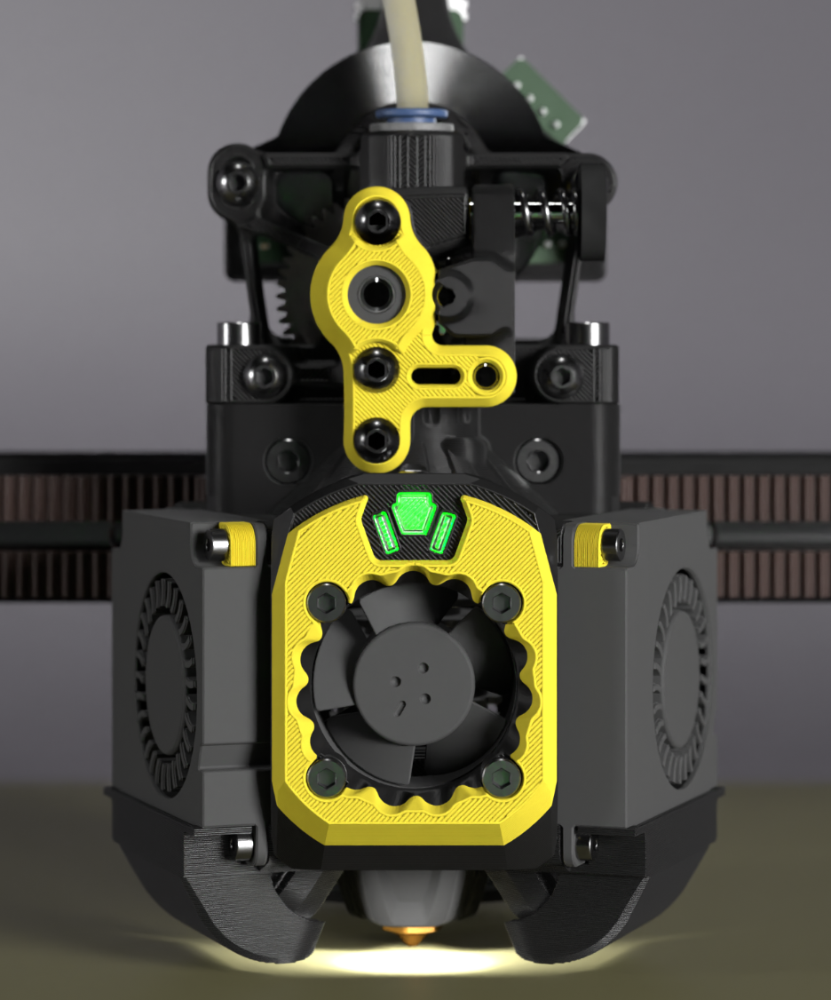

> ⚠️ **Not Done**: Everything below here still needs to be updated
> 

### These instructions are for off-printer assembly using Xol Carriage. If you use Voron TAP, scroll down, you have to do things differently.
The details below are for Rapido and Sherpa-Mini. We have faith that you can work it out from here if you're using a different combination of hotend and extruder. If you have trouble look for the #xol-toolhead channel on the Discord.
| Notes                                                                                                                                                                                                                                                                                                                                                                                                                                                                                                                                                                   | Image                                                                                                                                                                                                                                                                            |
| ----------------------------------------------------------------------------------------------------------------------------------------------------------------------------------------------------------------------------------------------------------------------------------------------------------------------------------------------------------------------------------------------------------------------------------------------------------------------------------------------------------------------------------------------------------------------- | -------------------------------------------------------------------------------------------------------------------------------------------------------------------------------------------------------------------------------------------------------------------------------- |
| Warm up the soldering iron again. It's time for heatsets    Starting with the Hotend Mount   4x M2 will hold the back two screws of each 4010 blower fan                                                                                                                                                                                                                                                                                                                                                                                                     | 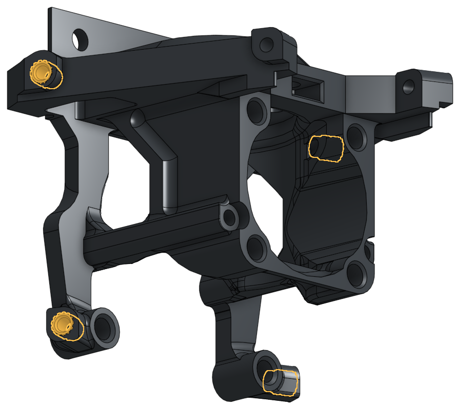                                                                                                                                                                                          |
| 2x M2.5 in the 'feet' for attaching to Xol-Carriage   `If you're using TAP or you skipped on the M2.5 heatsets, skip these. M3 heatsets will go into the bottom of the Xol-Carriage front part`                                                                                                                                                                                                                                                                                                                                                                       | 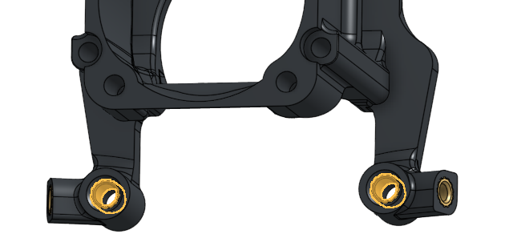                                                                                                                                                                                           |
| `Optional Fan Heatset versions`   4x M2.5 for Hotend fan mounting                                                                                                                                                                                                                                                                                                                                                                                                                                                                                                   | 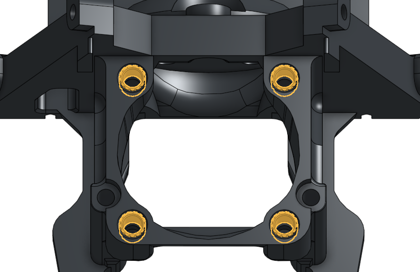                                                                                                                                                                                         |
| 1x M3 Hex Nut for the front extruder block attachment point.                                                                                                                                                                                                                                                                                                                                                                                           |                                                                                                                                                                                 |
| `Optional BONES`     These can be a little tricky. Screw in the M2x30 SHCS from the front of the hotend mount until they are about 5.5mm from being fully screwed in. Now put in the M2 heatset from the back, and while it's still hot screw the M2x30 all the way in. This aligns the heatset while the plastic is still soft     2x M2 Heatset   2x M2x30 SHCS                                                                                                                                                                                   | 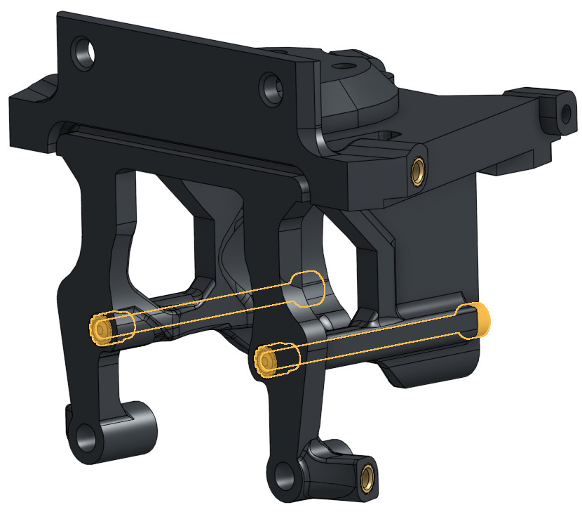                                                                                                                                                                                            |
| 2x M3 in the upper back of the extruder mount                                                                                                                                                                                                                                                                                                                                                                                                                                                                                                                           | 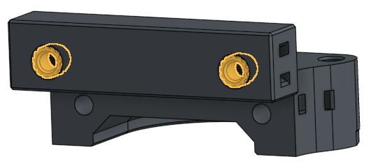                                                                                                                                                                                           |
| Don't let your extruder fall off!   `Different placement for different extruders`     0, 2, or 3 M3 Heatsets                                                                                                                                                                                                                                                                                                                                                                                                                                                | 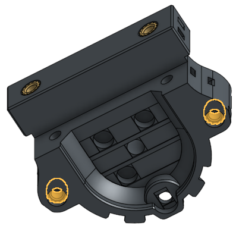                                                                                                                                                                                       |
| 4x M2 in the faceplate rear (LED or standard)       `The top two heatsets go in on the same angle as the bottom two, not straight in from the side`                                                                                                                                                                                                                                                                                                                                                                                                     | 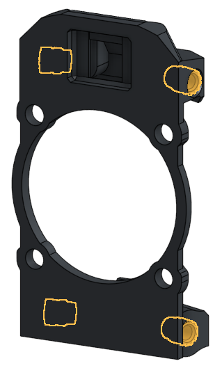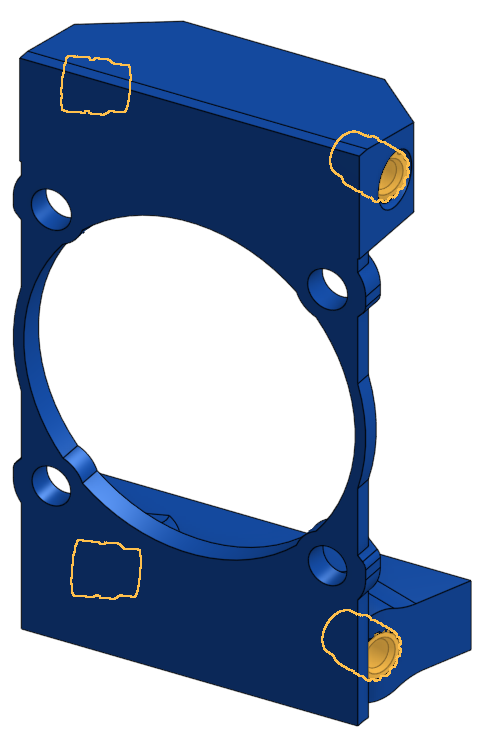 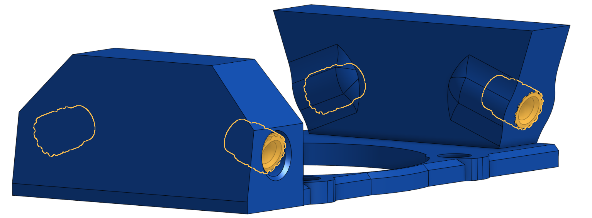                                           |
| Screw on the hotend and insert your PTFE tube   `Some hotend mounts will only fit three screws if using the Sherpa-Mini extruder mount. All four screws fit for other extruder mounts`     Find the [correct length PTFE](PTFE_Length.md) tube.                                                                                                                                                                                                                                                                                                                                                          | 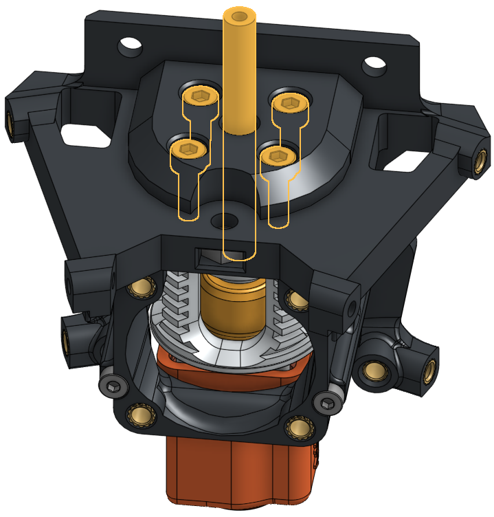                                                                                                                                                                                                              |
| Attach your extruder to the extruder mount with   M3 x [correct length and type for your extruder]   `Number and type of screws will be different for different extruders and mounts. We trust you to figure this out.`                                                                                                                                                                                                                                                                                                                                         | 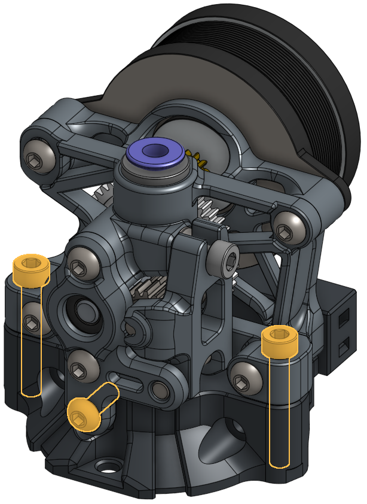                                                                                                                                                                                                           |
| Time to put the major pieces together   attach the Extruder Mount to the Hotend Mount.     1x M3x8 BHCS   2x M3x20 SHCS `Pass them through the holes to hold everything in place until it goes on the carriage`                                                                                                                                                                                                                                                                                                                                         |                                                                                                                                                                                                |
| Attach your stepper motor with M3 screws long enough to securely attach the M3 x 20mm metal stand offs                                                                                                                                                                                                                                                                                                                                                                                                                                                                  |                                                                                                                                                                                                               |
| Can you do the can-can? Me either. Attach your CAN or breakout board with   * 2x M3 x 16 SHCS                                                                                                                                                                                                                                                                                                                                                                                                                                                                       |                                                                                                                                                                                                             |
| If you're using the LED faceplate, make sure the diffuser is in place. It should fit in place tight enough to stay put, but not tight enough to break.                                                                                                                                                                                                                                                                                                                                                                                                                  | 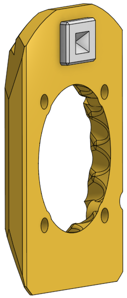                                                                                                                                                                                                    |
| Four screws to attach the hotend cooling fan. They go through the front and rear faceplate printed parts, and the 2510 fan.   4x M2.5 x 20 SHCS (`*don't over tighten especially if you're not using a fan heatset version`)    `If you're using LEDs, the middle one should be in the rear faceplate, with one hanging down each side towards where the ducts will go. The wires go over the top of the 2510 fan.`    `**For Dragon UHF the two lower M2.5 screws must be M2.5 x18 SHCS (or cut down M2.5 x20) even with no fan heatset inserts**` | 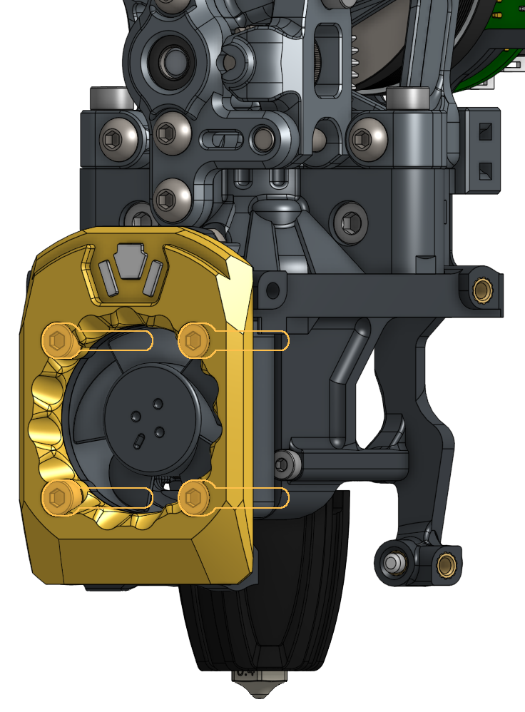                                                                                                                                                                                                             |
| Don't make a mess of it now.   `We've added a slot through the top of the hotend mount to route your wires and keep them away from the X/Y joints`                                                                                                                                                                                                                                                                                                                                                                                                                    | 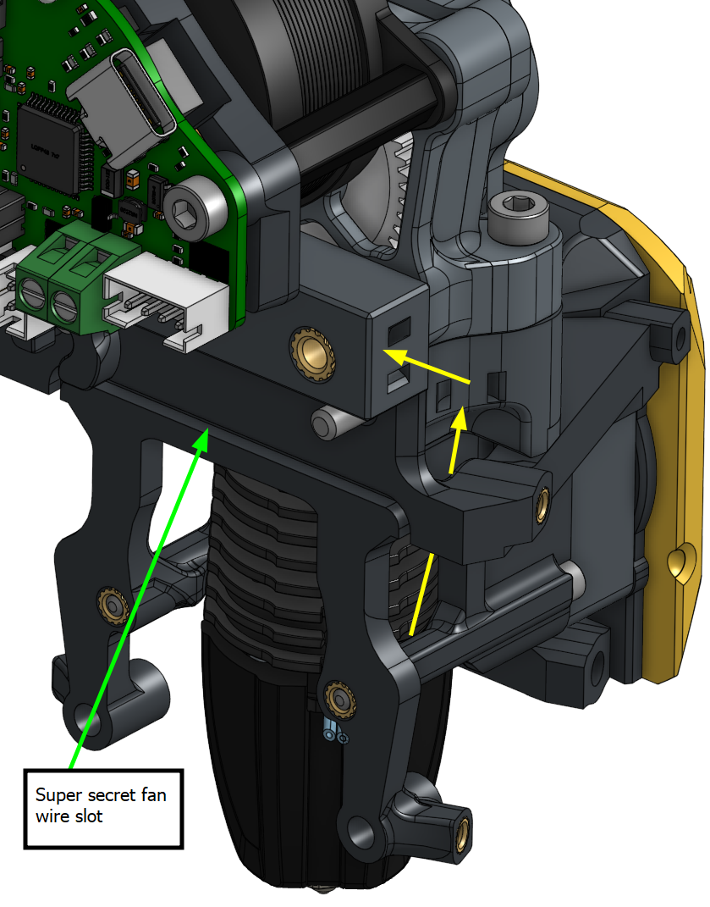                                                                                                                                                                                                                 |
| Make sure to remove the built-in supports from the ducts before you install them. |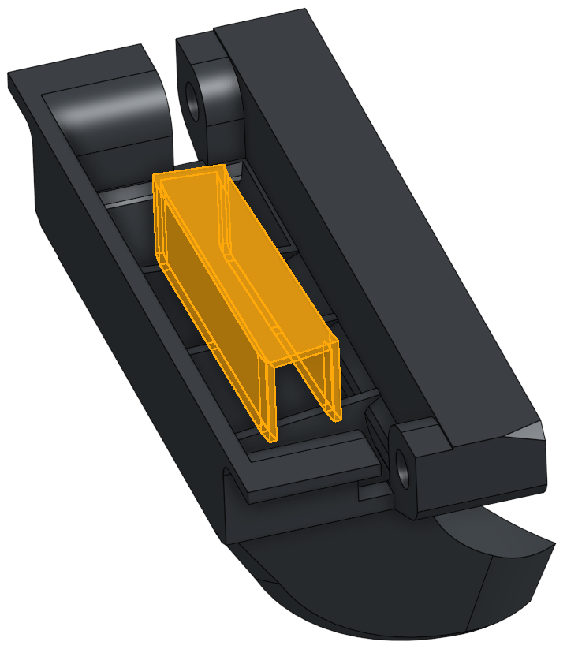|
| Each fan attaches with   * 3x M2 x 12 SHCS, and   * 1x M2 x 8 SCHS `top rear`            `Don't forget your M2 Savers (or shorten top SHCS by 2mm)`     `If you're using LEDs, push them into the sockets on the ducts before you attach the fans/duct to the toolhead`                                                                                                                                                                                                                                                                                                                                                        | 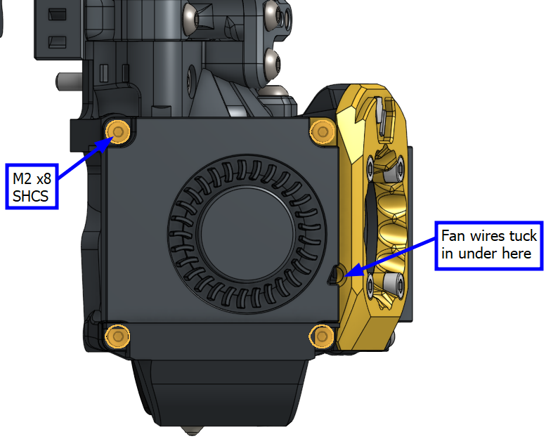     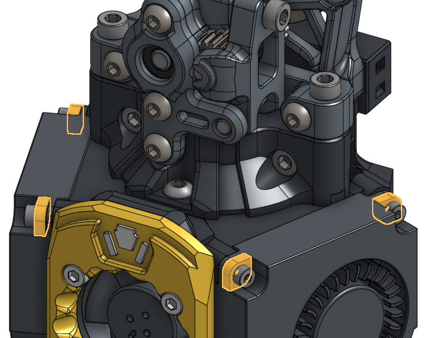                                                                                                                                                                                                                |
| Finish off your wiring and tidy up with the cable tie slots. It's finally time to put this thing on the printer.                                                                                                                                                                                                                                                                                                                                                                                                                                                        |                                                                                                                                                                                                                       |
| Time to install it in the printer!     Start with  2x M3 x 20 SHCS from the front                                                                                                                                                                                                                                                                                                                                                                                                                                                                           | 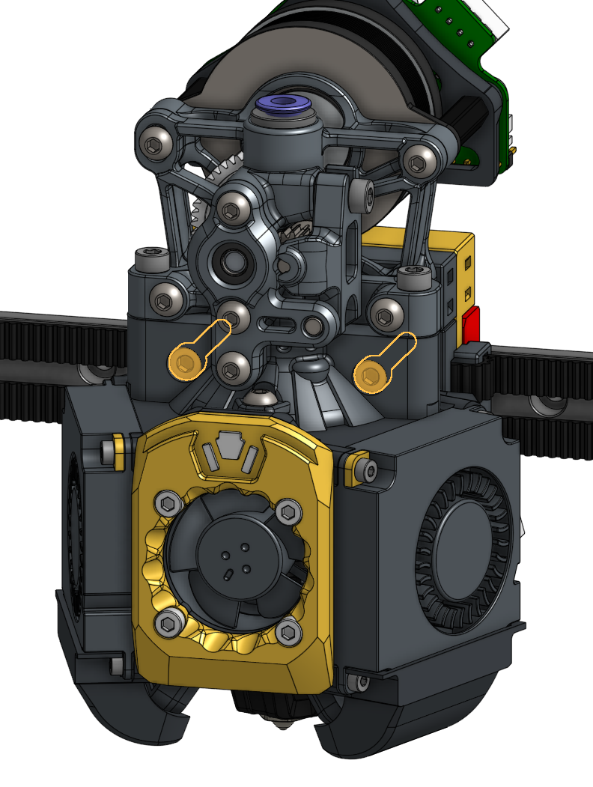                                                                                                                                                                                                |
| Sneak up from the rear with your Allen keys   * 3x M3 x 8 SHCS at the top, and   * 2x M2.5 x 10 SHCS at the bottom                                                                                                                                                                                                                                                                                                                                                                                                                                              |                                                                                                                                                                                                  |
| Plug in your probe wires `end stop too if you haven't converted to sensorless homing yet`   Connect your toolhead board or umbilical stuff. You're not using drag chains, are you?                                                                                                                                                                                                                                                                                                                                                                                  | 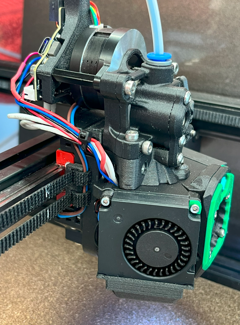                                                                                                                                             |
| You're done, but don't forget your software!!!                                                                                                                                                                                                                                                                                                                                                                                                                                                                                                                          | ⚠️ Things are probably different with your new setup.     * Endstop positions for X: `[stepper_x]` check `position_endstop` and `position_max`   * Your probe offset: Do a `probe_calibrate`   You know your printer better than anyone else. Check your work. |

### Here lie the instructions for installing Xol Toolhead on Voron TAP. 
If you haven't noticed yet, it's easier on Xol Carriage, but we get it TAP is TAP.

|Notes | Image |
|---------|----------|
| `Install TAP into your printer as per Voron Design instructions`     Once that's done, install the TAP adapter printed part for your extruder with   * 2x M3 x 8 SHCS | 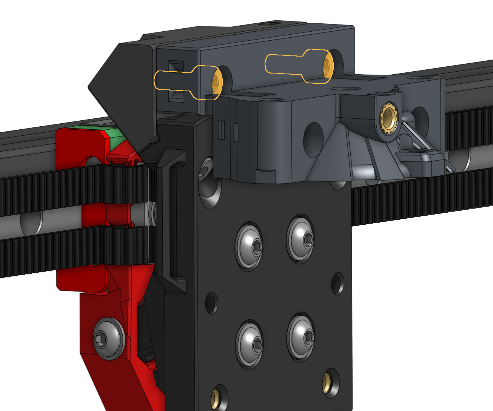 |
| Install heatsets as per instructions above   `Make sure not to put any in the feet. You may need to run an M3 drill through the feet too.` | 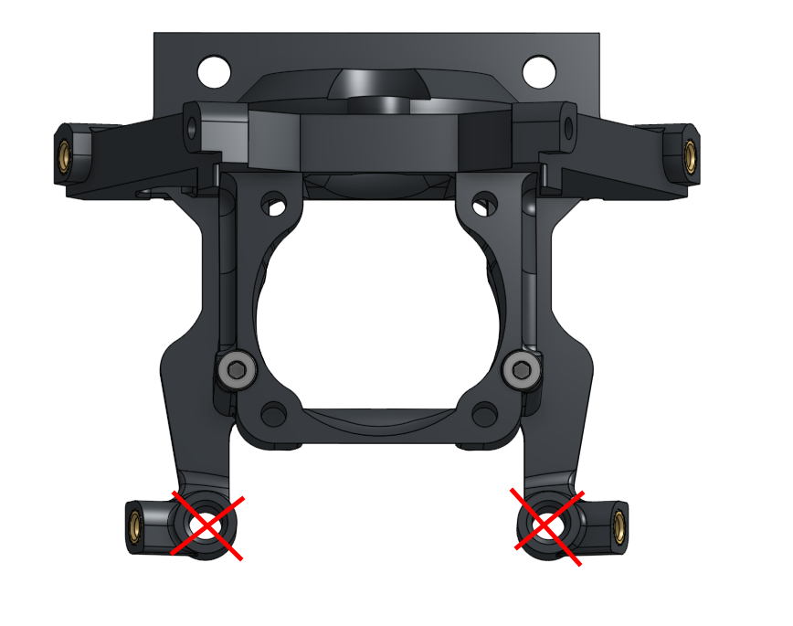 |
| Assemble the hotend mount with your hotend, 2510 HE cooling fan, faceplate parts and loosly attach the part cooling fans using the top screws only.  | 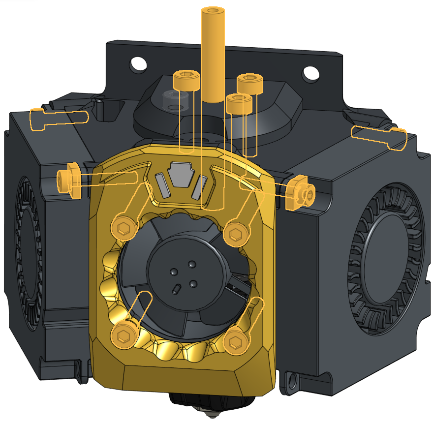 |
| Now you can slide the mostly assembled hotent mount parts up behind the extruder mount and onto TAP using   * 2x M3 x 20 SHCS (top),   * 1x M3 x8 BHCS (extruder mount to HE mount), and   * 2x M3 x 12 SCHS (in the feet)       `Make sure you have the PTFE tube that goes between the extruder and hotend installed before moving onto the next step. Failure to do so will end in tears`   [PTFE Tube Lengths](PTFE_Length.md) | 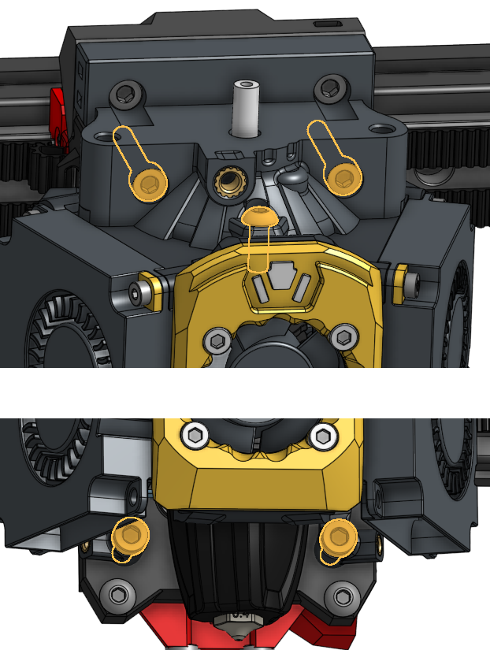 |
| Now you can attach the ducts and tighten all the M2 screws holding them, and the part cooling fans, on.  | 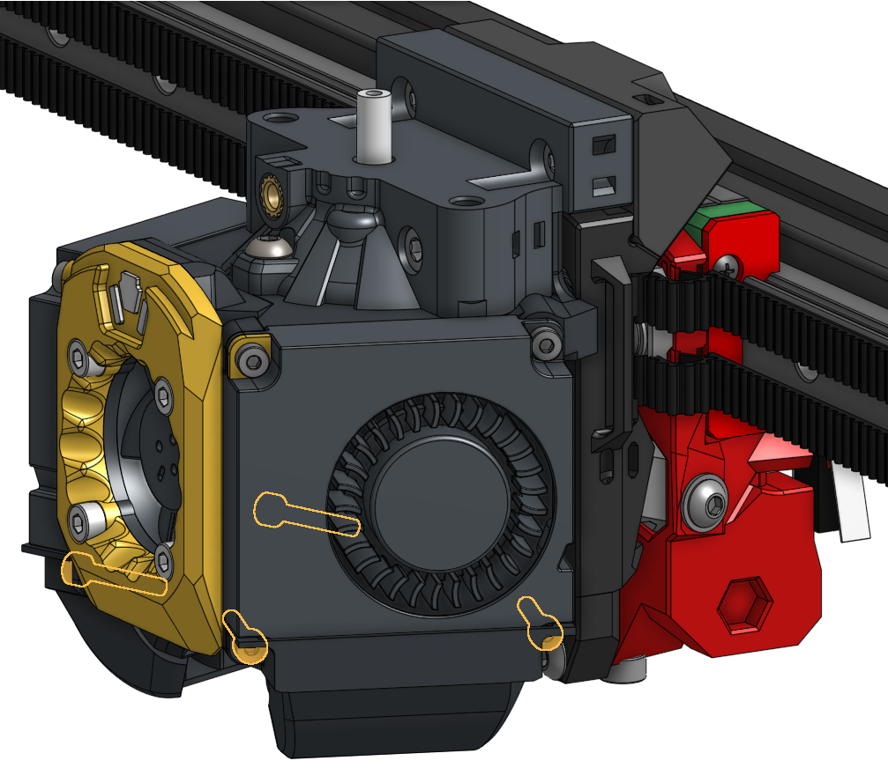 |
| Put your extruder, stand offs, EBB board mount and EBB board together. | 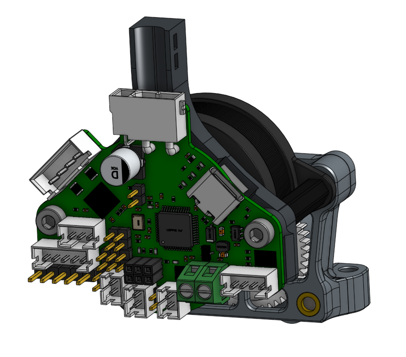 |
| Attach your extruder/board etc. to the top of the TAP adapter plate.   You're ready to finish wiring, software config and start printing. Sounds simples right? | 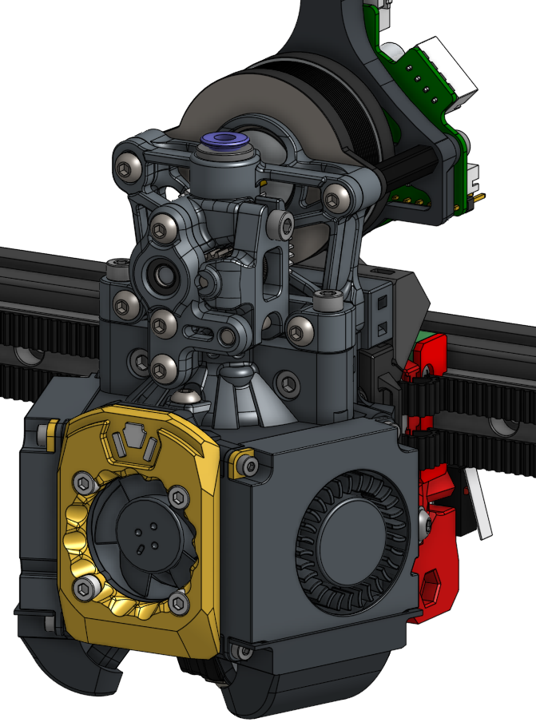 |

    
 ⬅ [Carriage assembly](xol_carriage_assembly.md)
