# Xol Carriage Assembly

| Notes                                                                                                                                                                                                                                                                                                                                                                                                                                                                                                                    | Image                                                                                                                                                                                                                                       |
| ------------------------------------------------------------------------------------------------------------------------------------------------------------------------------------------------------------------------------------------------------------------------------------------------------------------------------------------------------------------------------------------------------------------------------------------------------------------------------------------------------------------------ | ------------------------------------------------------------------------------------------------------------------------------------------------------------------------------------------------------------------------------------------- |
| Get the carriage ready by installing   * 5x M3 heatsets * 4x M3 hex nuts                                                                                                                                                                                                                                                                                                                                                                                                                                       | 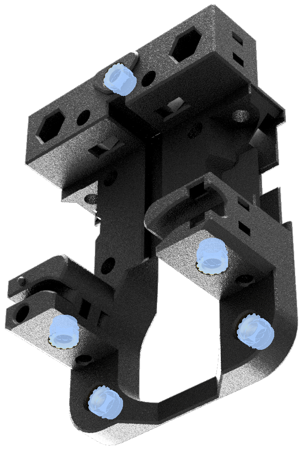   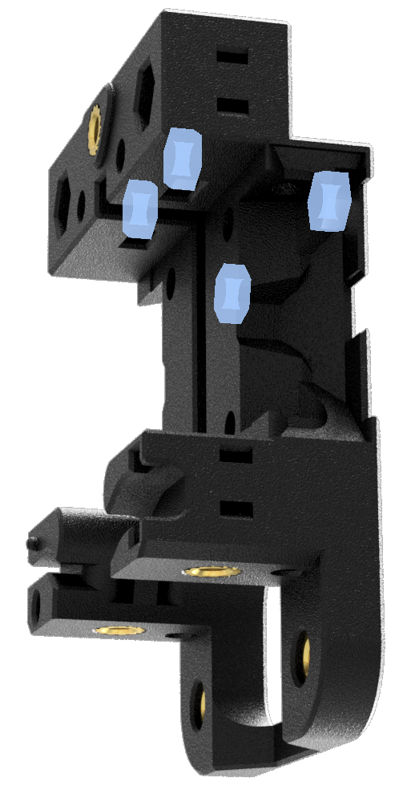   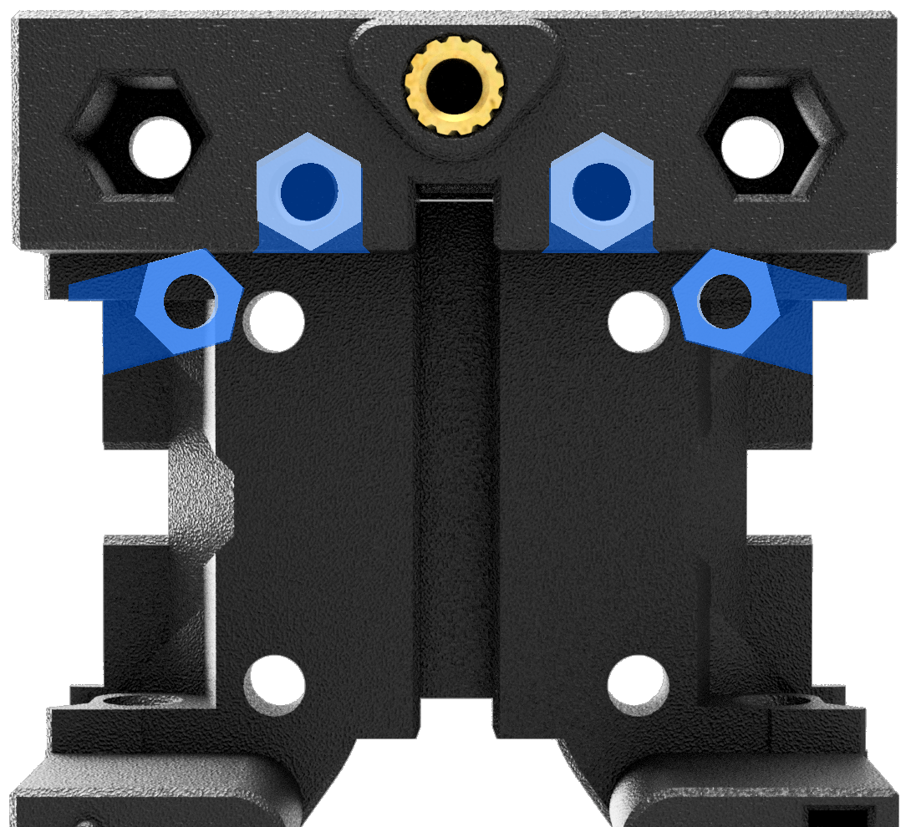 |
| Attach your probe module with 2x M3x6 BHCS                                                                                                                                                                                                                                                                                                                                                                                                                                                                               | 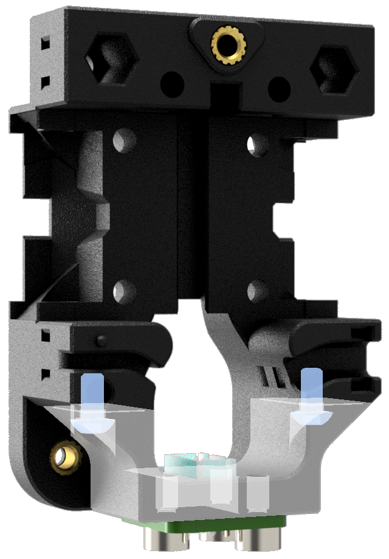                                                                                                                                                                |
| Run the probe wires up the channel before you install the carriage on the MGN rail. Don't forget to keep them secure using the cable tie slots.                                                                                                                                                                                                                                                                                                                                                                          | 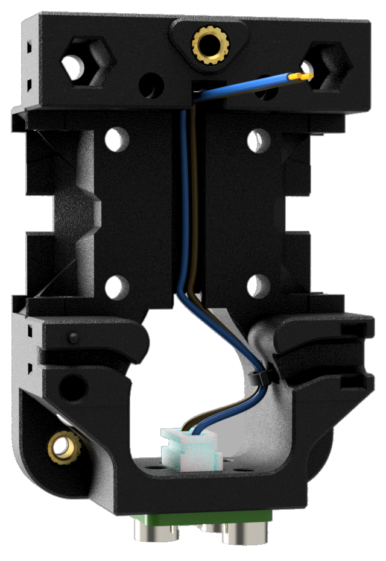                                                                                                                                                                 |
| `Option` _*If you haven't yet converted to sensorless homing, your X-endstop switch can be attached to the back of the carriage._   Install the switch with 2x M2x10 self tapping screws                                                                                                                                                                                                                                                                                                                     | 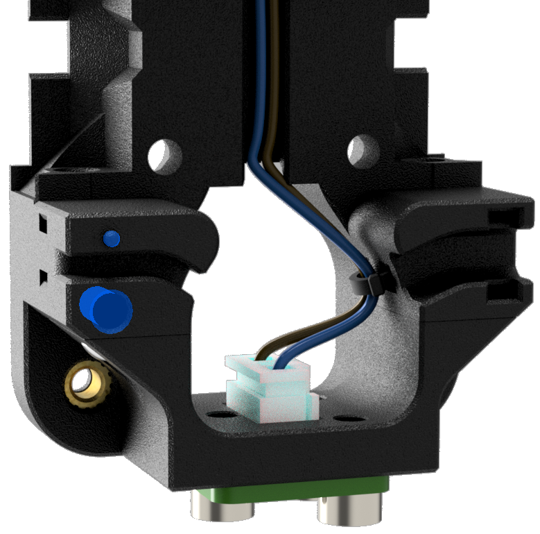                                                                                                                                                                   |
| Put the carriage on the MGN rail with  4 M3x8 SHCS                                                                                                                                                                                                                                                                                                                                                                                                                                                              | 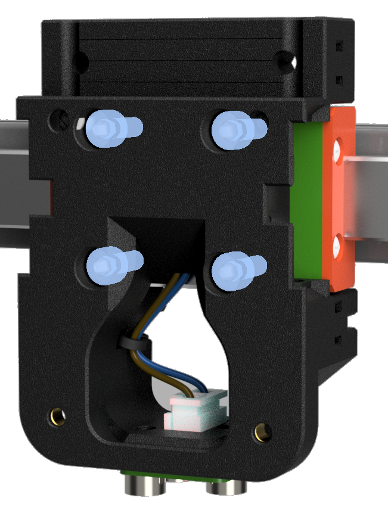                                                                                                                                                               |
| Use 2x M3x8 SHCS and 2x large M3 washers to 'clamp' the carriage to the MGN rail. `M3 + M5 washers can be stacked if you don't have the large M3 washers`                                                                                                                                                                                                                                                                                                                                                                | 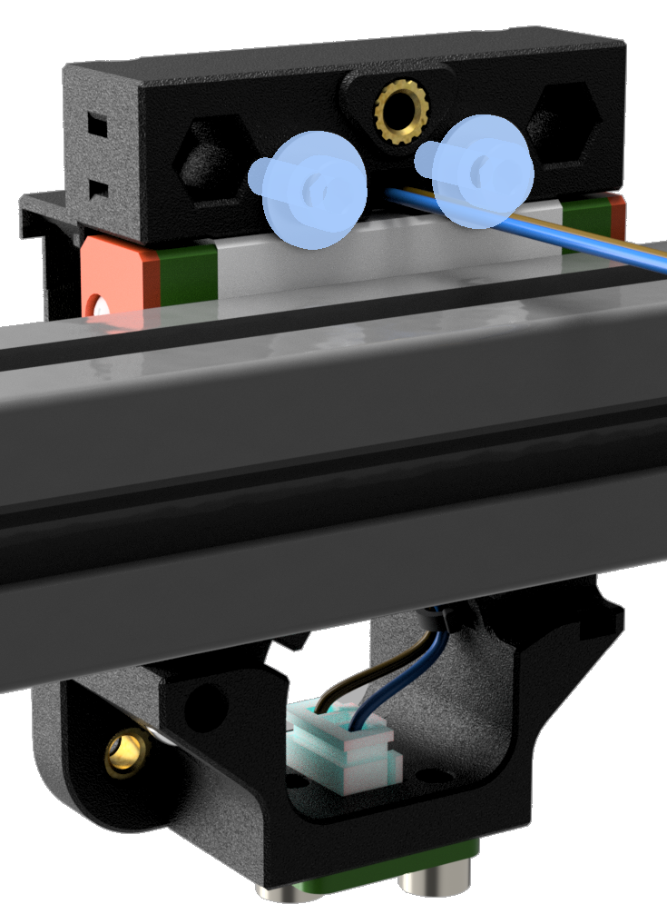   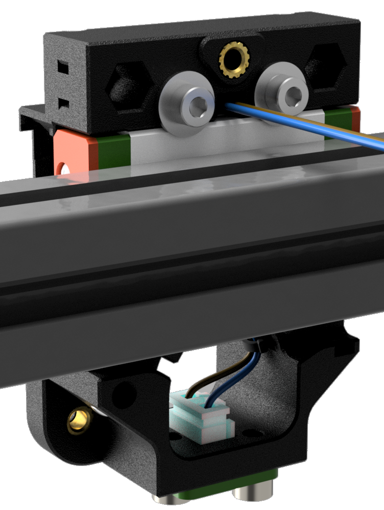                                                                  |
| Install the belts and tubes into the belt clips. It should look like the picture when installed correctly.  `Cut away view to show the belt path inside the clip`      * Pull your belt through the belt clips.   * Make a loop and pinch together so that the teeth are locking together.   * Pull the belt back through the same hole in the clip.   * Leave enough slack in the previous step, and slide the 4mm OD tubes through the opening of the loop and through the centre of the clip. | 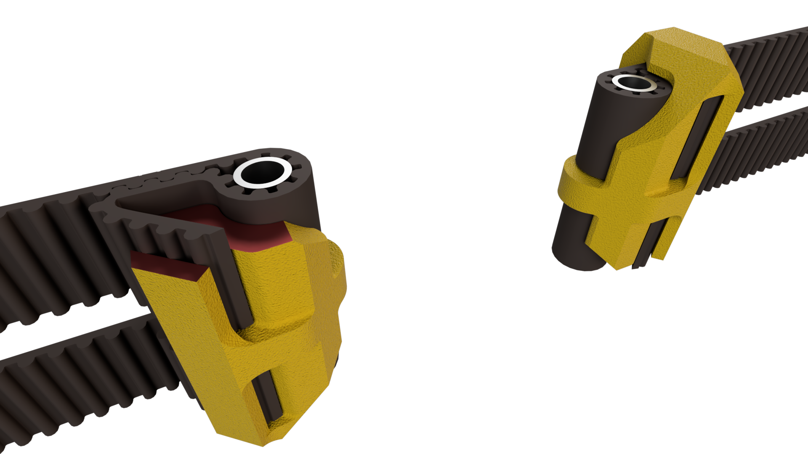                                                                                                                                                                  |
| Push the belt/clip/tube assembly into the side of the carriage so that it lines up and you can push the M3x30 pin down from the top and through the tube. Repeat for the other side.                                                                                                                                                                                                                                                                                                                                     | 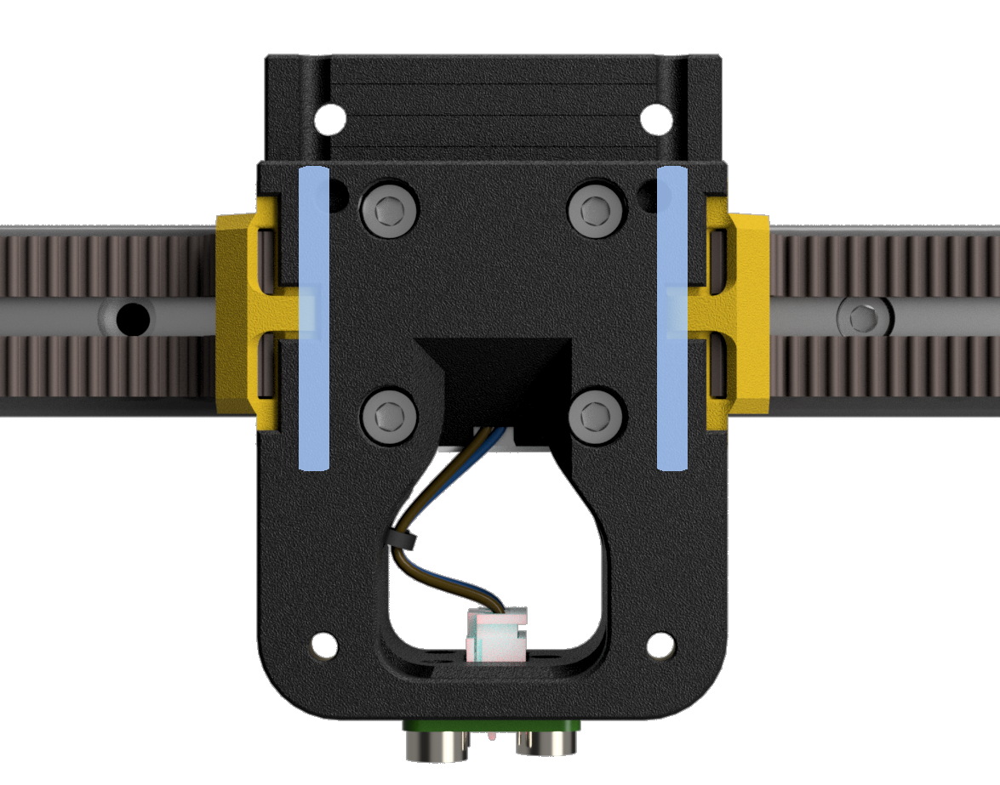                                                                                                                                                                   |
| Tada!!! You have a completed Xol Carriage ready to attach the toolhead                                                                                                                                                                                                                                                                                                                                                                                                                                                   |                                                                                                                                                                          |

    
⬅  [Printed parts](printing.md) - [Toolhead assembly](toolhead_assembly.md) ➡
