# Xol Carriage Assembly
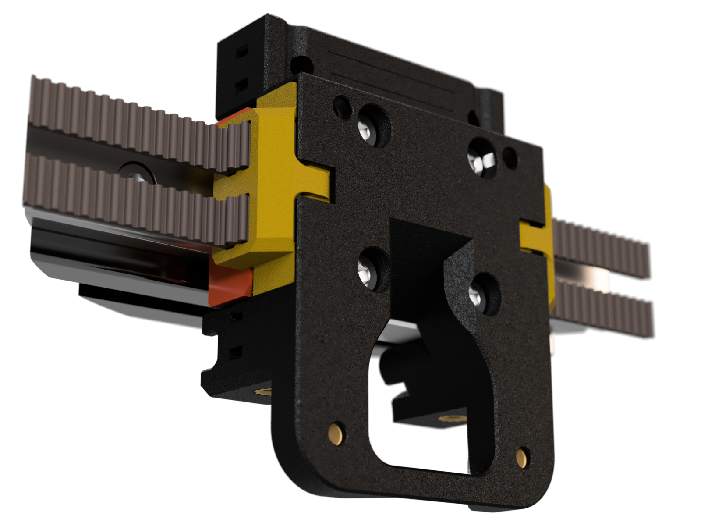

> ⚠️ **Not Done**: Everything below here still needs to be updated

| Notes | Image |
|---------|----------|
| Get the carriage rear ready by installing   * 3 M3 heatsets * 4 M3 hex nuts                `For MGN9 Carriage variants, replace 2 M3 hex nuts with 2 M3 heatsets` | 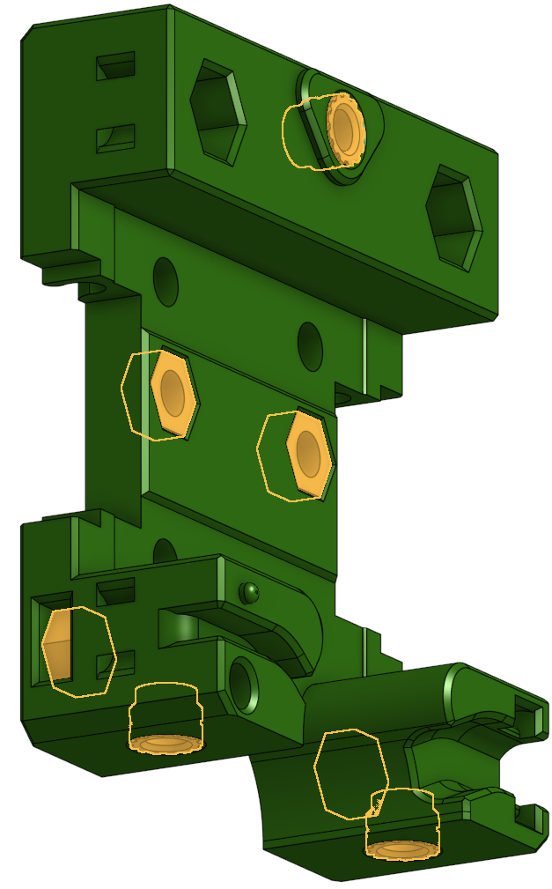    |
| Add the hardware to carriage front  * 2 M3 heatsets    `These are put in from the rear face of the carriage front and are pushed a pit past flush with the surface.` |  |
| `Option` _*If you still want to pull your toolhead apart while it's on the printer and didn't buy M2.5 heatsets_.   Put another 2x M3 heatsets in the back of the carriage front    `This is an alternative for people who don't have M2.5 heatset inserts. If you have the M2.5 heatsets, leave these holes free and install M2.5 heatsets into the "feet" of the hotend mount.` |   |
| `Option` _*If you haven't yet converted to sensorless homing, your X-endstop switch can be attached to the carriage rear._   Install an M2 heatset in the back of the carriage rear     The switch is attached with 1 M2x10 SHCS |  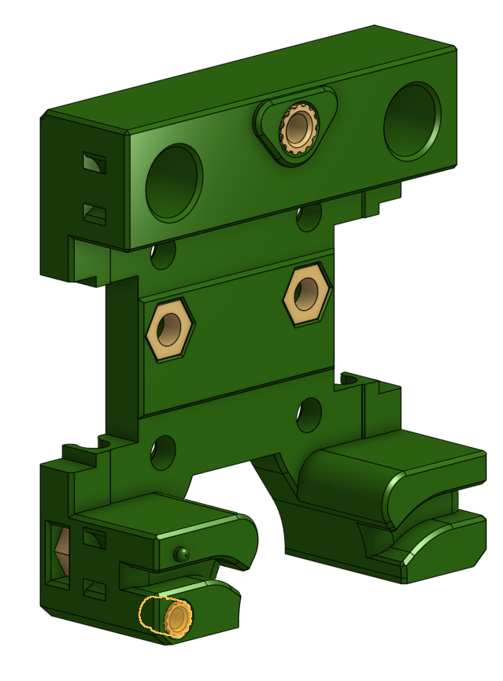   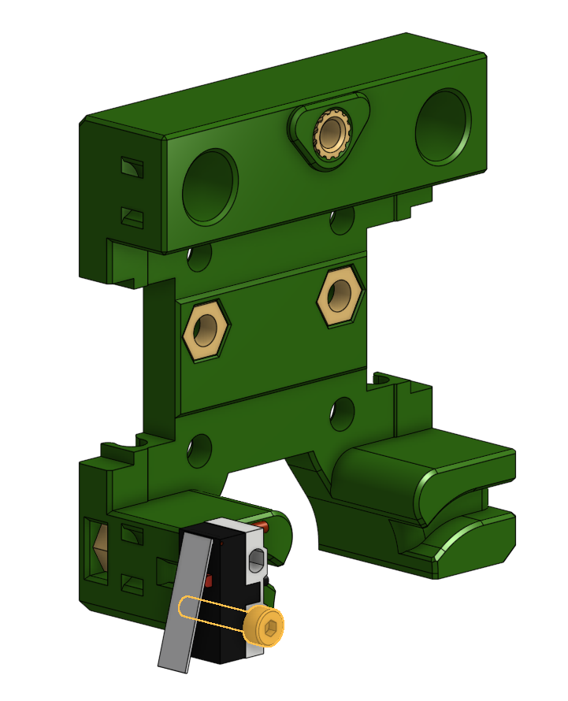 |
| Put carriage rear on the printer with  4 M3x6 BHCS       `For MGN9 Carriage variants, use 4 M3x8 SHCS`  |    |
| Put the M3 25mm pins into the belt clips | 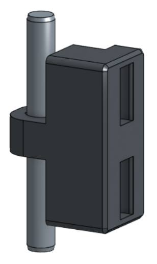 |
| Install belts onto the belt clips There's a front and a back to the clips, I trust you to figure it out. | 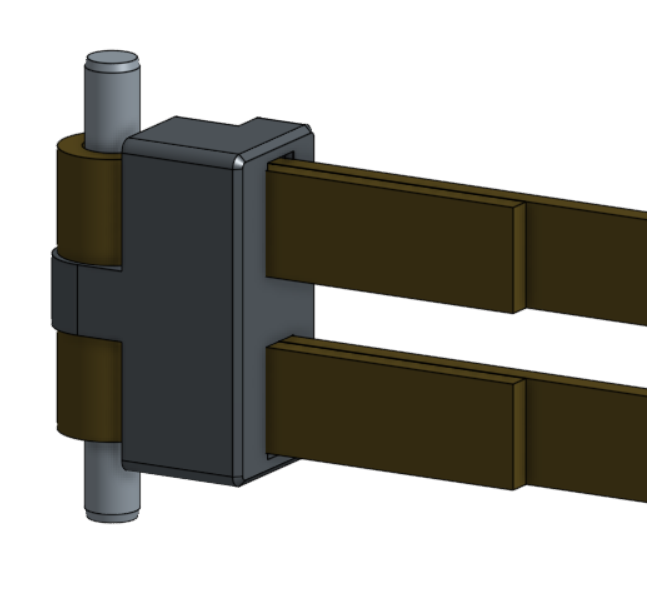 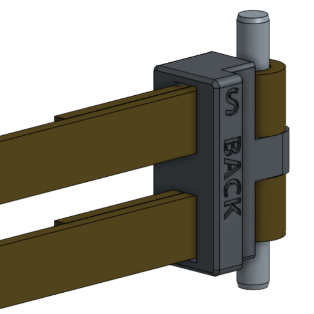 |
| Attach the belts and take in the satisfying "snap" as they go in.  `* If you can see the word "BACK" now you mucked it up` | 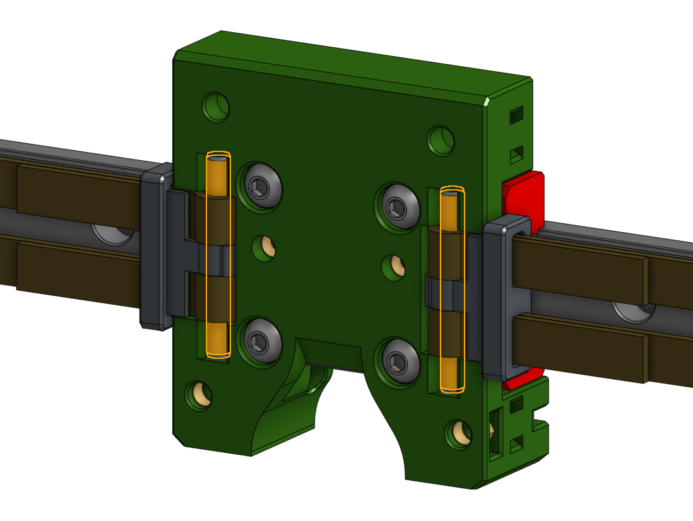 |
| Time to put on the carriage front with   4 M3x8 SHCS | 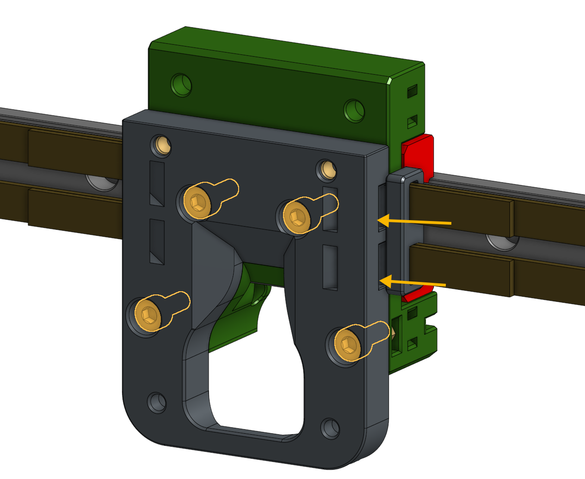 |
| It's probing time, insert  2 M3x6 BHCS | 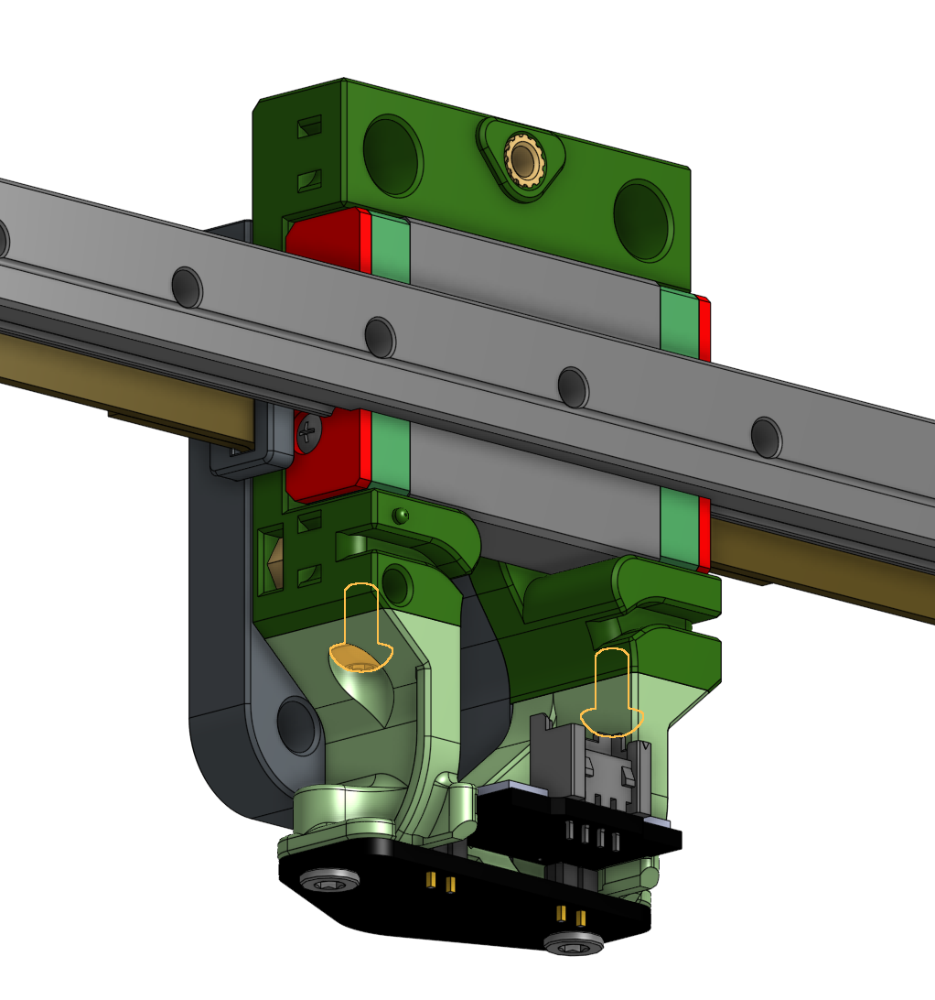 |
| Don't forget to tuck in your belts   `Tip: start with the belts too long. Make sure you have the same lenght on both belts and trim them flush to the front of the carriage with flush cutters after tucking them in.` | 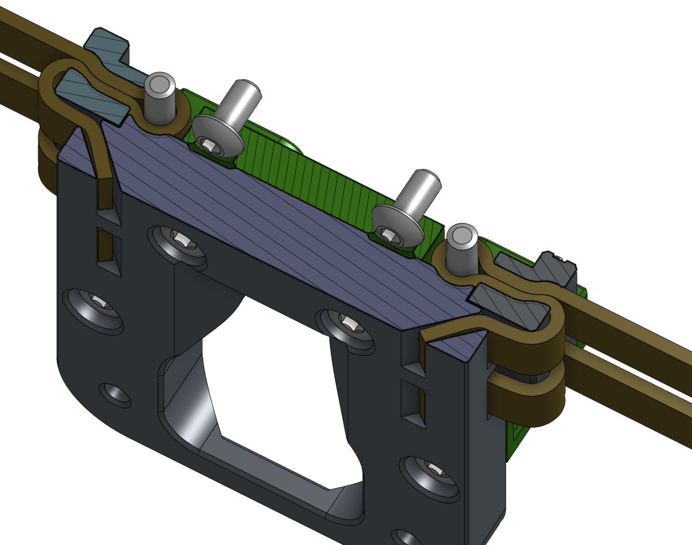 |

    
⬅  [Printed parts](printing.md) - [Toolhead assembly](toolhead_assembly.md) ➡
