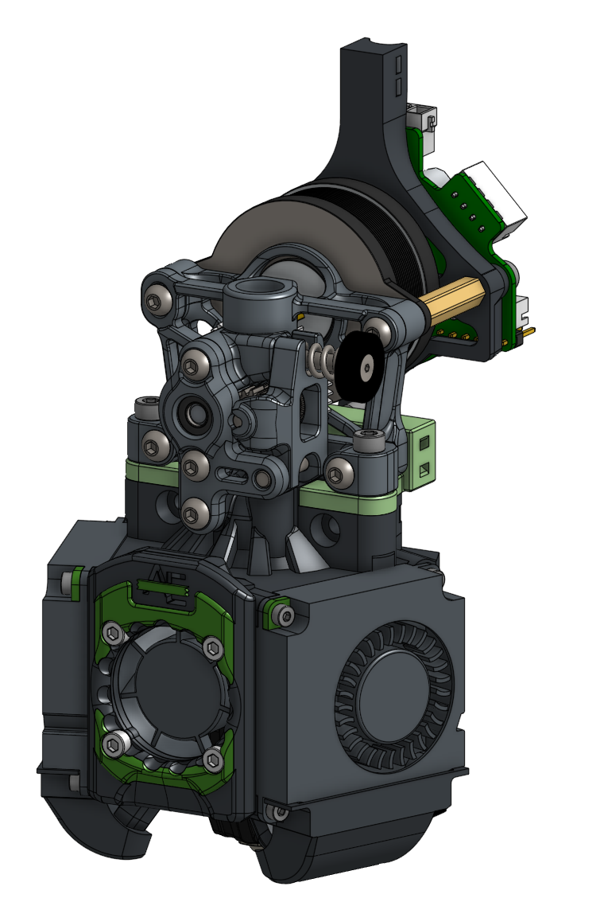

# Xol Toolhead Assembly

### These instructions are for off-printer assembly using Xol Carriage. If you use Voron TAP, scroll down, you have to do things differently.
The details below are for Rapido and Sherpa-Mini. We have faith that you can work it out from here if you're using a different combination of hotend and extruder. If you have trouble look for the #xol-toolhead channel on the Discord.
|Notes | Image |
|---------|----------|
| Warm up the soldering iron again. It's time for heatsets * 2x M3 (+1 if using Sherpa Mini) * 2x M2.5 in the feet  * 4x M2.5 if you're using them for the hotend fan   * 4x M2 for Part cooling fan rear mounting points   `If you're using TAP don't put M2.5 heatsets in the feet. Also, if you're using TAP why are you reading this? Your instructions are at the bottom of the page` |  |
| 4x M2 in the faceplate rear (LED or standard)       `The top two heatsets go in on the same angle as the bottom two, not straight in from the side` |   |
| Don't forget these 2 in the back of the adapter plate |  |
| Screw on the hotend. |  |
| Insert the [correct length PTFE](PTFE_Length.md) tube and get your adapter plate ready.| <table><tr><td>    Sherpa Mini </td><td>    DFA</td> </tr> <tr><td>    Vz-Hextrudort-Low  / LGX-Lite</td><td>    Orbiter v2.0</td> </tr> </table> |
| Attach your extruder with   M3 x [correct length and type for your extruder] |  |
| Attach your stepper motor with M3 screws long enough to securely attach the M3 x 20mm metal stand offs |  |
| Can you do the can-can? me either. Attach your CAN or breakout board with   * 2x M3 x 16 SHCS |  |
| If you're using the LED faceplate, make sure the diffuser is in place. A little drop of super glue helps a lot here.|  |
| Four screws to attach the hotend cooling fan. They go through the front and rear faceplate printed parts, and the 2510 fan.   4x M2.5 x 20 SHCS (no fan heatsets `*don't over tighten`)   4x M2.5 x 16 SCHS (with fan heatsets)    `If you're using LEDs, the middle one should be in the rear faceplate, with one hanging down each side towards where the ducts will go. The wires go over the top of the 2510 fan.`    `**For Dragon UHF the two lower M2.5 screws must be M2.5 x16 SHCS even with no fan heatset inserts**` |  |
| Don't make a mess of it now.   Think about where you're wires will go |  |
| Each fan attaches with   * 3x M2 x 12 SHCS, and   * 1x M2 x 8 SCHS `top rear`    `If you're using LEDs, push them into the sockets on the ducts before you attach the fans/duct to the toolhead` |  |
| Finish off your wiring and tidy up with the cable tie slots. It's finally time to put this thing on the printer.|  |
| * 2x M3 x 20 SHCS from the front |  |
|Sneak up from the rear with your Allen keys   * 3x M3 x 8 SHCS at the top, and   * 2x M2.5 x 10 SHCS at the bottom |  |
|Plug in your probe wires `end stop too if you haven't converted to sensorless homing yet`   Connect your toolhead board or umbilical stuff. You're not using drag chains, are you?    You're done! `but don't forgot your software. Check [stepper_x] section for position_endstop and position_max.` |  |

### Here lie the instructions for installing Xol Toolhead on Voron TAP. 
If you haven't noticed yet, it's easier on Xol Carriage, but we get it TAP is TAP.

|Notes | Image |
|---------|----------|
| `Install TAP into your printer as per Voron Design instructions`     Once that's done, install the TAP adapter printed part for your extruder with   * 2x M3 x 8 SHCS |  |
| Install heatsets as per instructions above   `Make sure not to put any in the feet. You may need to run an M3 drill through the feet too.` |  |
| Assemble the hotend mount with your hotend, 2510 HE cooling fan, faceplate parts and loosly attach the part cooling fans using the top screws only.  |  |
| Now you can put the mostly assembled hotent mount parts onto TAP using   * 2x M3 x 20 SHCS, and   * 2x M3 x 12 SCHS       `Make sure you have the PTFE tube that goes between the extruder and hotend installed before moving onto the next step. Failure to do so will end in tears`   [PTFE Tube Lengths](PTFE_Length.md) |  |
| Now you can attach the ducts and tighten all the M2 screws holding them, and the part cooling fans, on.  |  |
| Put your extruder, stand offs, EBB board mount and EBB board together. |  |
| Attach your extruder/board etc. to the top of the TAP adapter plate.   You're ready to finish wiring, software config and start printing. Sounds simples right? |  |

 ⬅ [Carriage assembly](xol_carriage_assembly.md)
