# Xol Carriage Assembly
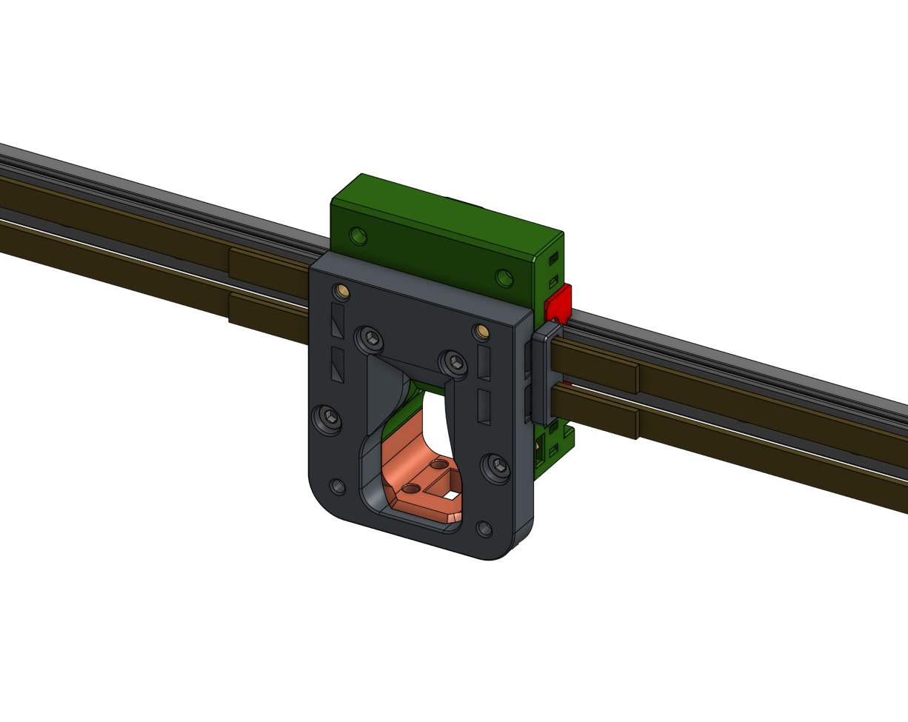

Notes | Image 
---------|----------
 Get the carriage rear ready by installing   * 3 m3 heatsets * 4 m3 hex nuts                `For MGN9 Carriage variants, replace 2 m3 hex nuts with 2 m3 heatsets` | 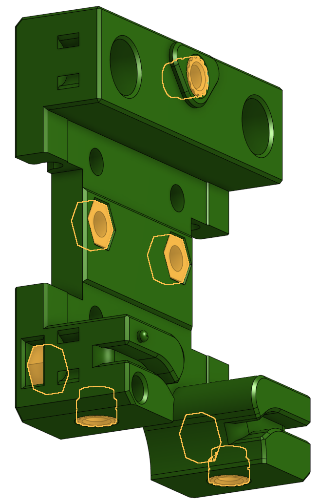   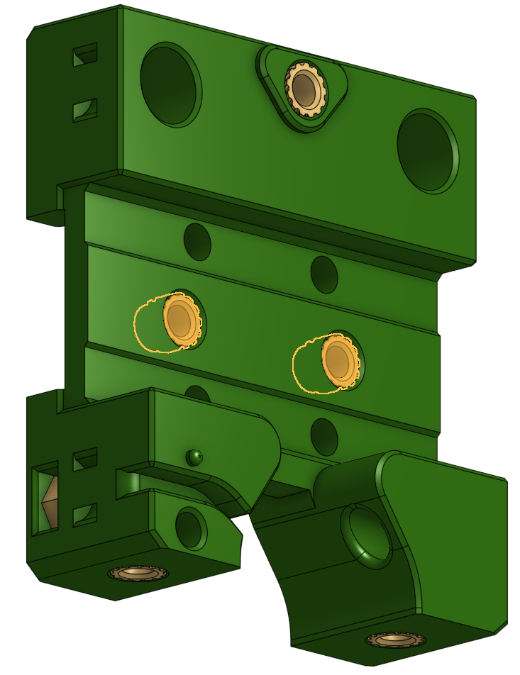
 Add the hardware to carriage front  * 2 m3 heatsets | 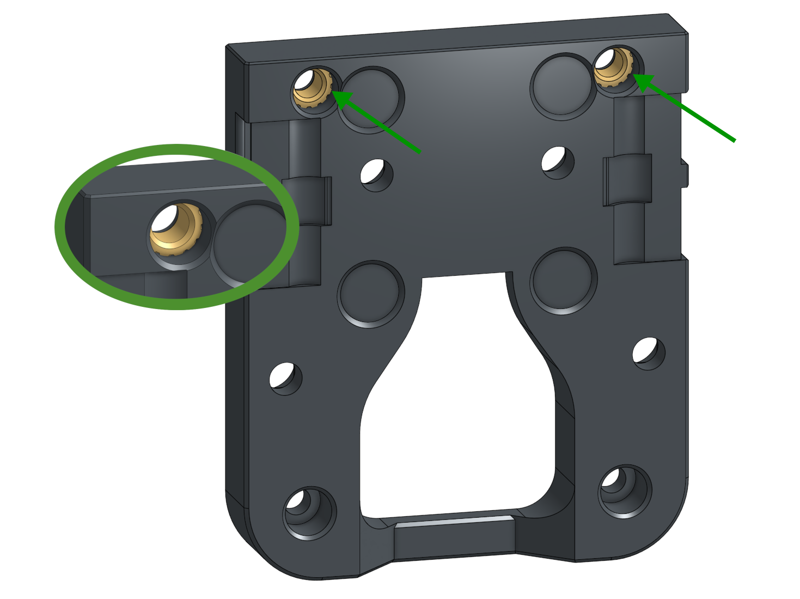
 `Option` _*If you still want to pull your toolhead apart while it's on the printer and didn't buy m2.5 heatsets_.  Put another 2x m3 heatsets in the back of the carriage front |  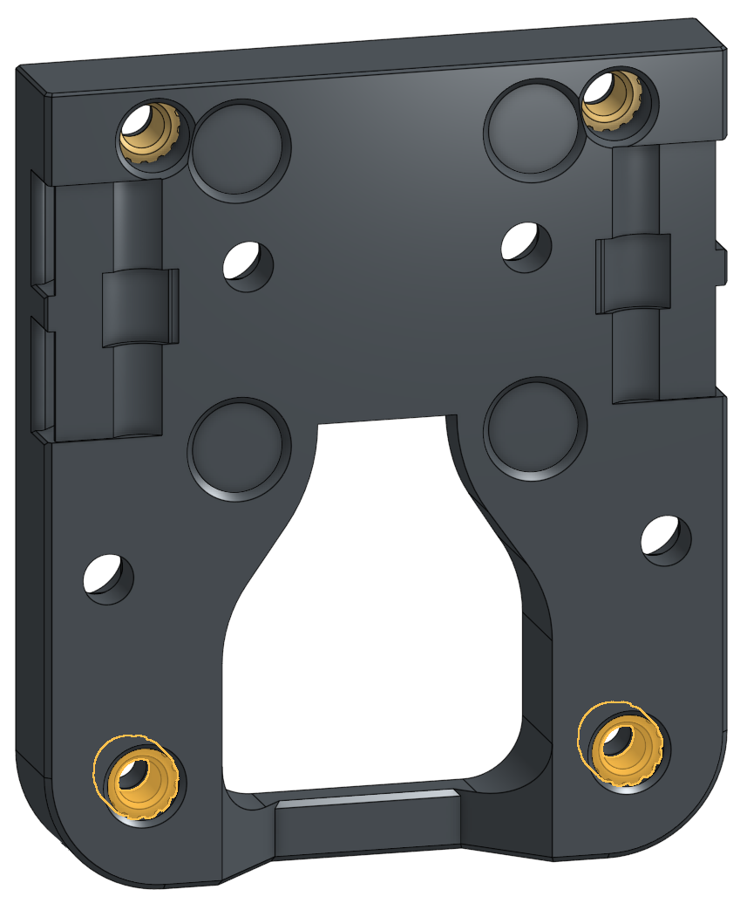
 Put carriage rear on the printer with  4 m3x6 BHCS               `For MGN9 Carriage variants, use 4 m3x8 SHCS`  | 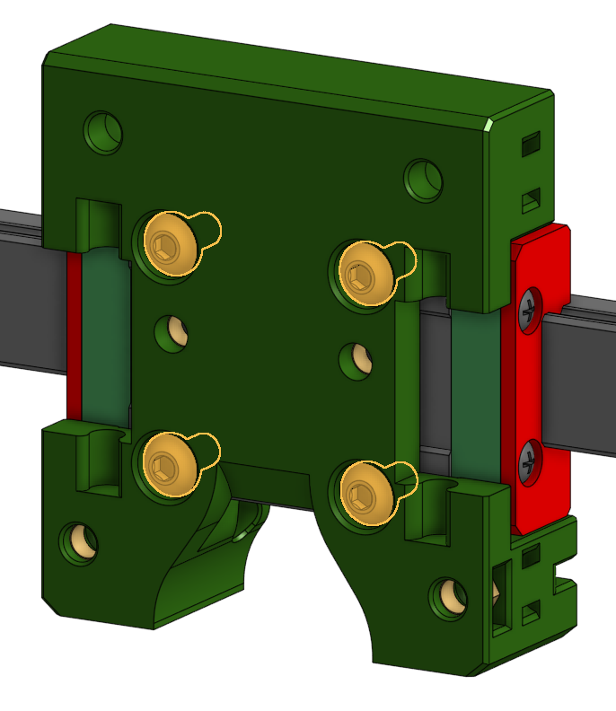  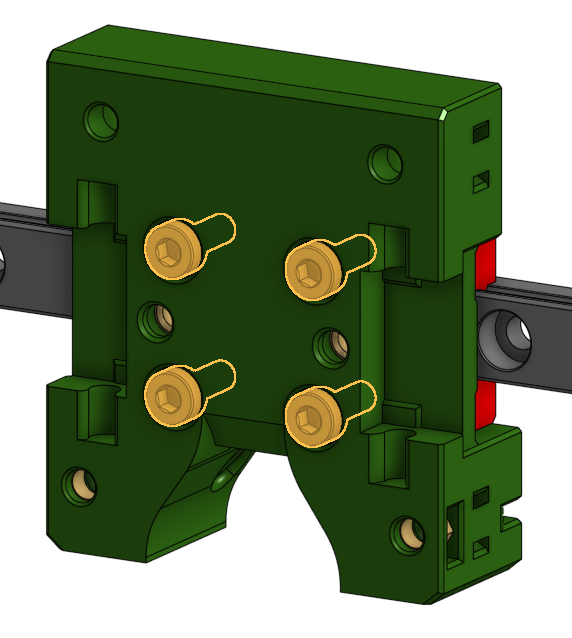
 Put the M3 25mm pins into the belt clips | 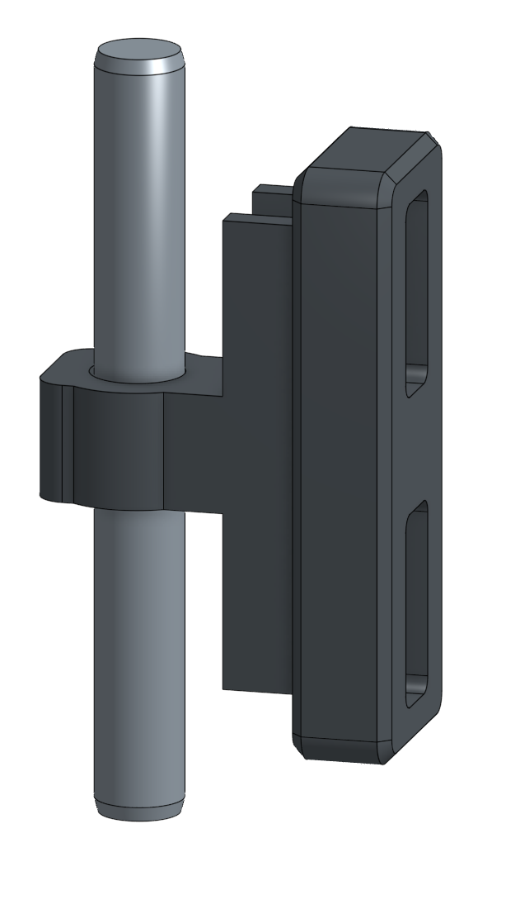
 Install belts onto the belt clips There's a front and a back to the clips, I trust you to figure it out. | 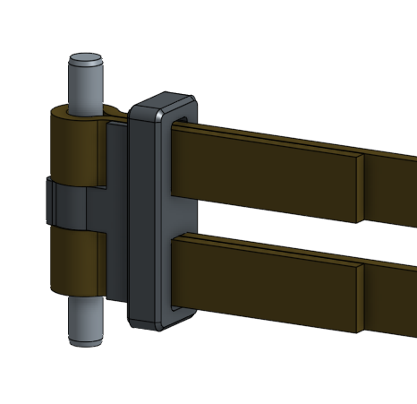 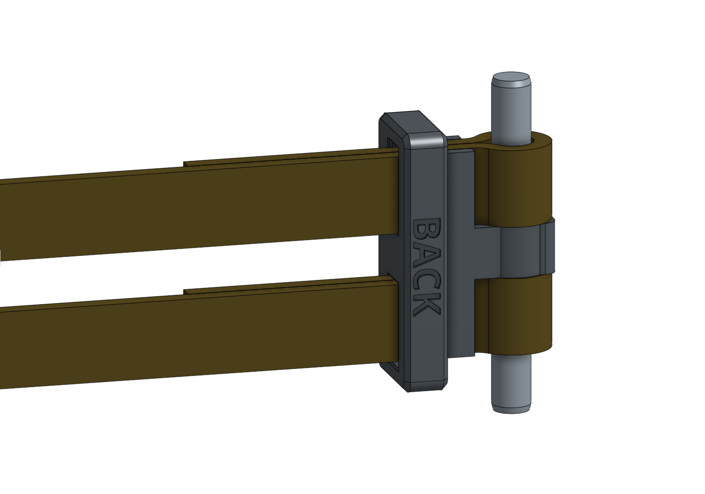
 Attach the belts and take in the satisfying "snap" as they go in.  `* If you can see the work "BACK" now you mucked it up` | 
 Time to put on the carriage front with   4 m3x8 SHCS | 
 It's probe time. use  2 m3x6 BHCS | 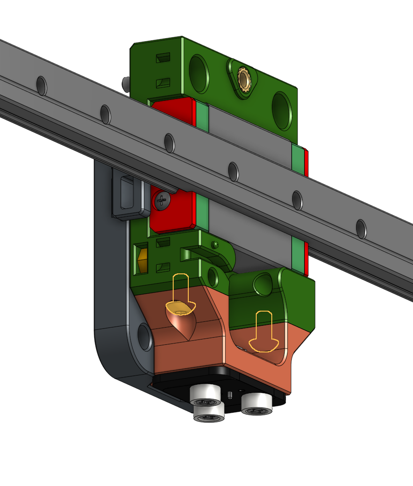

⬅  [Printed parts](printing.md) - [Toolhead assembly](toolhead_assembly.md) ➡